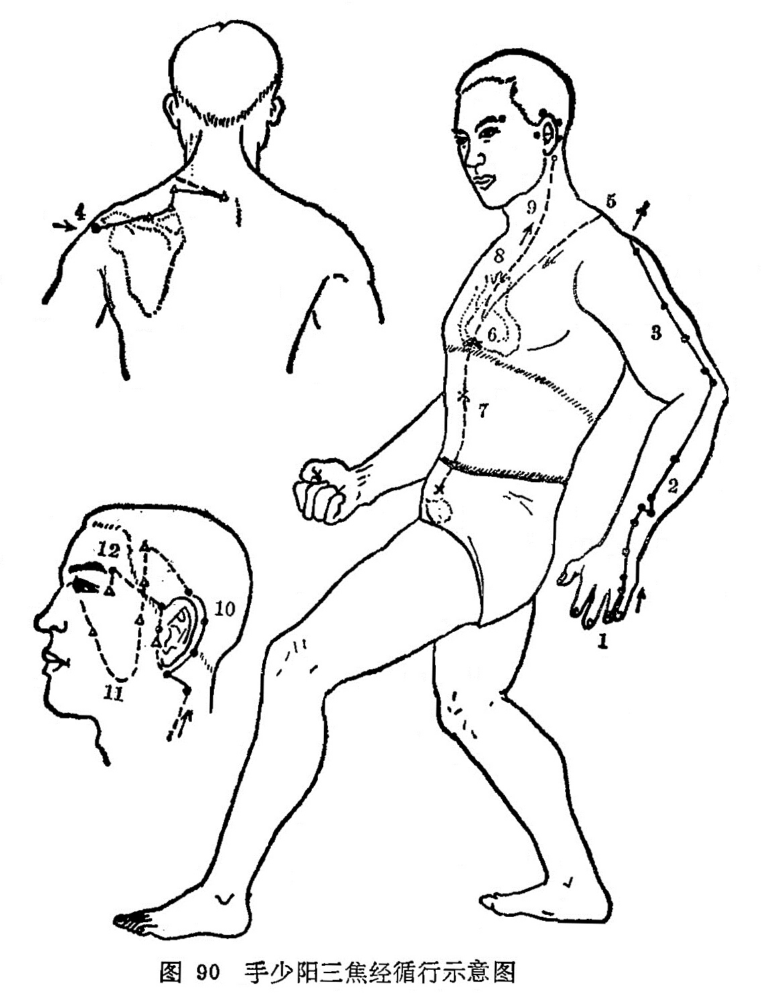

#### （一）分布络属

分布径路：受手厥阴心包经之交，起于手无名指尺侧端，出第四、五掌骨之间，沿手背到腕部，上行尺、桡骨之间，通过肘尖，沿上臂外侧，向上到肩部，在第7颈椎棘突下左右相交，出足少阳的后面，向前进入锁骨上窝，分布在胸内膻中部，散布联络心包，穿过膈肌，归属上、中、下三焦。

它的上行一支，从膻中部向上浅出锁骨上窝，上行到项部，联系耳后边，再直向上行出耳上角，然后屈曲向下到达面颊部，直到眼下。

它的另一支脉，从耳后边进入耳中，出来行走于耳前，经过上关穴前面，在面颊部和前面那条支脉相交，到达外眼角，交给足少阳胆经（图90）。

络属脏腑：属三焦，络心包。

经过器官：耳，眼。

本经腧穴：

十手少阳属三焦，后正中线头侧绕。

**关冲**无名指甲外，**液门**节前指缝邀。

**中渚**液门上一寸，**阳池**腕表横纹中。

腕后二寸取**外关**，**支沟**腕后三寸安。

**会宗**沟外横一寸，**三阳络**在四寸间。

肘前五寸称**四渎**，肘后一寸**天井**酌。

肘上二寸**清冷渊**，渊臑之间取**消泺**。

**臑会**肩端下三寸，**肩髃**后一**肩髎**藏。

**天髎**肩井后寸陷，**天牖**颈肌后下扪。

耳垂后陷**翳风**讨，**瘈脉**耳后青络找。

**颅息**亦在青络上，**角孙**耳上发际标。

**耳门**耳前缺陷处，**和髎**耳前锐发交。

欲知**丝竹空**何在，眼眶外缘上眉梢。

图90手少阳三焦经循行示意图

图解：三焦手少阳之脉，①起于小指次指之端，上出两指之间，循手表腕，②出臂外两骨之间，上贯肘，③循臑外；④上肩而交出足少阳之后，⑥入缺盆，布膻中，⑥散络心包，下膈，⑦遍属三焦。其支者，⑧从膻中上出缺盆，⑨上项，⑩系耳后，直上出耳上角，⑪以屈下颊至䪼。其支者，⑫从耳后入耳中，出走耳前，过客主人前，交颊至目锐眦（《灵枢·经脉》）。
