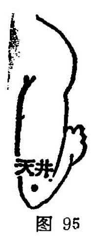

##### 天井

〔定位〕在尺骨鹰嘴后上方1寸，屈肘呈凹陷处取之（图95）。

〔解剖〕有肱二头肌腱，肘关节动、静脉网；布有前臂侧皮神经和桡神经肌支。

〔功能〕清化痰热，疏经利节。

〔主治〕偏头痛，胁肋、颈项、肩背痛，耳聋，瘰疬，癫痫，咳喘短气。

〔刺灸〕直刺0.5~1寸。可灸。

〔讲述〕出《灵枢·本输》。上部为天，凹陷为井，穴当肘尖上1寸，两筋间陷中，状若高山之天池；但三焦为决渎之官，不言池，而名为天井。穴属合土，为本经之子穴，本穴除主手臂麻木不仁外，主要用治三焦经之实症，以及耳聋、瘰疬、癫痫之疾。《甲乙》：治肘痛引肩不可屈伸，振寒热，颈项肩背痛，臂痿痹不仁，癫疾吐舌沫出，羊鸣戾颈。《金鉴》：治瘰疬瘾疹。《图翼》：泻一切瘰疬。临床常配曲池治肘关节痛麻，屈伸不利；配支沟治胸胁痛；配心俞、神道治悲愁恍惚，悲伤不乐。配后溪、巨阙治痛风，配少海治瘰疬。本穴所以能治瘰疬，是因瘰疬多生于耳前后、颈项间，"以及胸前腋下，今取少海、天井乃循经远刺以治本，且少海为心之合水穴，刺之能益水泻火，清热凉血以消除瘰疬；同时心经从心系上行于肺，横出腋下，上循臂内侧，下贯肘中，故最适用于胸侧、腋下之瘰疬。天井亦属合土穴，系本经之子穴，三焦经循耳下缺盆、肩上、胁下等处，故凡三焦气机不宣，肝胆火郁，痰湿流窜经络，气液蕴结不化所生瘰疬，泻天井能疏泄三焦气滞，调和经络，疏通气血，使三焦决渎有权，则升降正常，水道通畅，痰湿得以内化则核消退，所以说可泻一切瘰疬。取天井治瘰疬，昔时多主张灸疗，且左病灸右， 右病灸左。《玉龙歌》：“天井二穴多着艾，纵生瘰疬灸皆安。”
