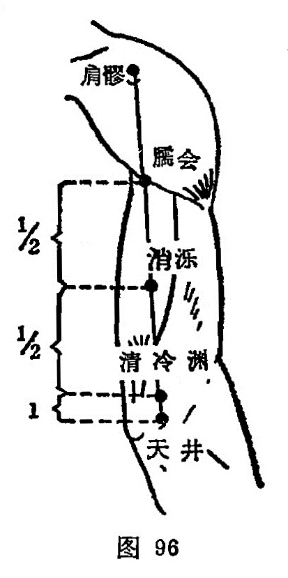

##### 消泺

〔定位〕在尺骨鹰嘴与肩髎的连线上，当臑会与清冷渊中点取穴（图96）。

〔解剖〕在肱三头肌肌腹的中间，有中侧副动、静脉；布有臂背侧皮神经及桡神经。

〔功能〕清热止痛，疏筋活络。

〔主治〕头痛，颈项强痛，臂痛，齿痛。

〔刺灸〕直刺0.8~1.2寸。可灸。

〔讲述〕见于《甲乙》。消有退的含意，泺指水泊。消泺为水退成低凹处，其穴适当上臂内旋时，是处有凹陷，又有清热作用，因名。《甲乙》：治头痛项背急。《大成》：治风痹，颈项急，肿痛寒热，头痛，癫疾。临床常配风池、天柱治颈项强急，配大椎、肩中俞治肩臂痛，配窍阴治项痛。

