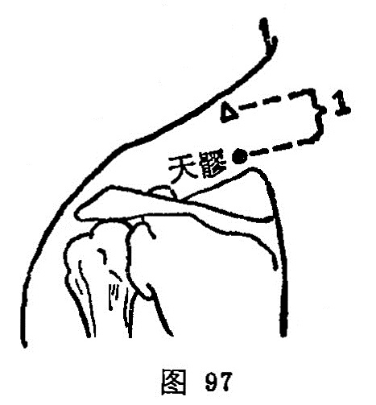

##### 天髎

〔定位〕肩井下1寸，当肩胛骨上角处取穴（图97）。

〔解剖〕有斜方肌，岗上肌，有颈横动脉降支，深层为肩胛上动脉肌支；布有第l胸神经后支外侧皮支，副神经，深层为肩胛上神经肌支。

〔功能〕祛风湿，通经络。

〔主治〕肩肘痛，颈项强痛，胸中烦满。

〔刺灸〕直刺0.5~0.8寸。可灸。

〔讲述〕见于《甲乙》。上部为天，骨隙称膠，穴当肩胛岗上凹陷中，因名。本穴除治肩肘痛外，还可用于颈项强痛，胸中烦满。《甲乙》：治身热汗不出，胸中热满。《大成》：治胸中烦闷，肩臂痠痛，缺盆中痛，汗不出，胸中烦满，颈项急，寒热，这是因为穴系手少阳、足少阳以及阳维之会。临床常配天宗、肩髃、曲池治肩臂痛。
