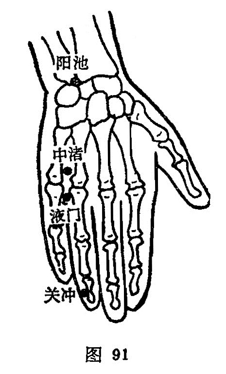

##### 液门

〔定位〕在四、五指指缝间，指掌关节前凹陷中（图91）。

〔解剖〕有来自尺动脉的指背动脉；布有来自尺神经的手背支。

〔功能〕清头明目，消肿止痛。

〔主治〕头痛，目赤，耳鸣，耳聋，齿齦肿痛，喉痹，疟疾，手臂痛。

〔刺灸〕直刺0.3~0.5寸。可灸。

〔讲述〕出《灵枢·本输》。别称腋门、掖门。液指水之精，出入之处为门，本穴为三焦经荥水穴；荥指小水，脉气由此始发，因名。根据荥主身热，故刺用泻法，能清头目，利三焦。《甲乙》：治疟，项痛，因忽暴逆，风寒热。《金鉴》：治咽喉外肿，牙齦痛，手臂红肿，耳暴聋，不得眠，此皆三焦壅热所致。临床常配鱼际治喉痛；配陶道治疟疾；配听宫、耳门治耳鸣聋；配中诸、通里治热病，头痛，面热，无汗；配中诸治手臂红肿。《金针梅花诗钞》：疟疾久不愈，于发作前食顷深针液门三寸，透过中渚与少府，直抵阳池，得气后静以久留，约当发作过乃去针；针之无不愈。可供参考。

