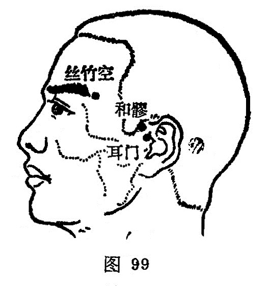

##### 耳门

〔定位〕耳屏上切迹前方，下颌骨髁状突后缘凹陷中，张口取穴（图99）。

〔解剖〕有颞浅动、静脉耳前支；布有耳颞神经，面神经分支。

〔功能〕通气机，开耳窍，疏邪热。

〔主治〕耳聋，耳鸣，朜耳，齿痛，颈颔痛，唇吻强。

〔刺灸〕直刺0.5~1寸。

〔讲述〕见于《甲乙》。别称小耳、耳前。穴当耳前、耳珠上方切迹凹陷处，主治耳部疾患，有耳之门户之意，因名。《甲乙》：治耳聋鸣，头颔痛。《铜人》：治耳有脓汁出，生疮膣耳，鸣耳如躁声，重听无所闻，齿齲。临床常配翳风、合谷治耳脓汁，配三里治耳鸣腰痛，配中渚、外关治耳鸣聋，配丝竹空治牙痛。《甲乙》：耳中有脓，禁不可灸。

