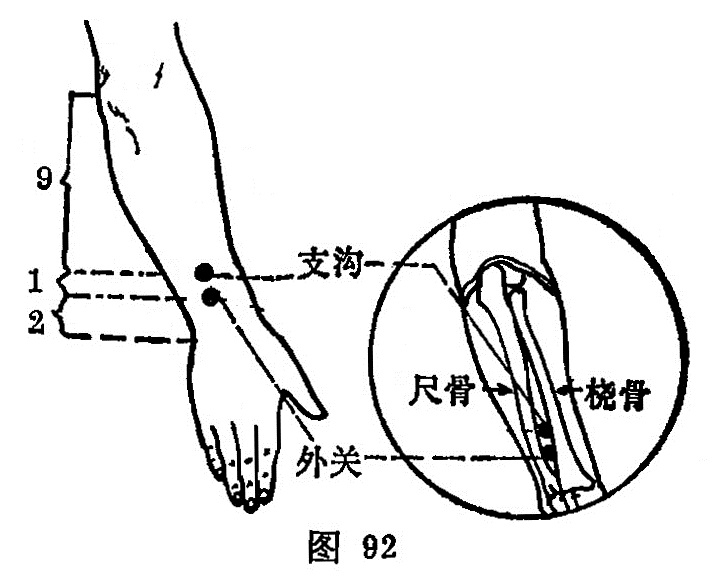

##### 外关

〔定位〕腕背横纹上2寸，桡骨与尺骨之间处（图92）。

〔解剖〕在尺、桡骨之间，指总伸肌与拇长伸肌之间，深层有臂骨间背侧动脉和掌侧动、静脉；布有前臂背侧皮神经，深层有前臂骨间背侧神经及掌侧神经。

〔功能〕清热消肿，通经，止痛。

〔主治〕热病，头痛，颊肿，耳鸣，耳聋，目赤肿痛，肩、背、胁痛，肘臂屈伸不利、麻木，以及产后血晕，胞衣不下诸疾。

〔刺灸〕直刺0.5~1寸。可灸。

〔讲述〕出《灵枢·经脉》。外指阳侧，穴属手少阳三焦之别络，别走心主厥阴，又与内关相对，因名。穴属别络，又系八脉交会穴之一，通于阳维脉。《甲乙》：治口僻禁，肘中濯濯，臂内廉痛不可及头，耳炖炖无所闻。《铜人》：治肘臂不得屈伸，五指尽痛，不能握物，耳聋无所闻。临床常配会宗治耳浑浑焞焞无所闻，透内关治胁肋痛，配足临泣治手足少阳经所过部位及其所属絡脏腑病症，所谓“临泣外关分主客”。配大椎、曲池、合谷治感冒发烧，属风寒加列缺，风热加尺泽。配肩髃、曲池、手三里、合谷治上肢瘫瘓。由于穴属阳维，分布肩背腰腿等处，对肌肉痹痛有卓效。临床配照海可治腹部剧痛，胞衣难下之慢产，这是因为外关络穴，补之能充实三焦之原气，增强体力，以盛妊妇之气而催产；由于照海与阴跻相通，主治子宫疾患，刺之能缓解胸腹疼痛，二穴合用，相得益彰。
