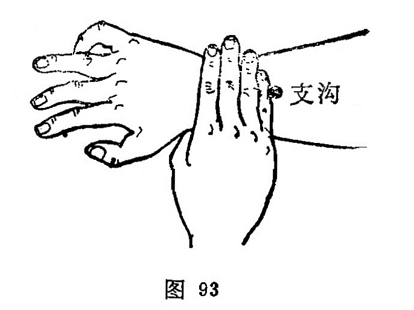

##### 支沟

〔定位〕阳池穴上3寸，尺、桡骨之间，或腕横纹上四横指处（图92、93）。

〔解剖〕在指总伸肌与拇长伸肌之间，屈肘俯掌时则在指总伸肌之桡侧，深层有前臂骨间背侧动脉及掌侧动、静脉；有前臂背侧皮神经，深层有前臂骨间背侧神经。

〔功能〕疏利三焦，聪耳利胁。

〔主治〕暴暗，耳鸣；耳聋，肩背痠痛，便秘，热病，胁肋痛，瘰病。

〔刺灸〕直刺0.8~1.2寸。可灸。

〔讲述〕出《灵枢·本输》。别称飞虎。支与肢通，狭窄为沟，穴处正当上肢两筋两骨狭窄之间，为脉气经过之处，因名。本穴主要用治三焦相火炽盛诸疾。《金鉴》：治卒心痛，三焦相火炽盛及大便不通，胁肋疼痛，妇人产后血晕，不省人事。临床常配阳陵泉治胁痛；配大横、丰隆、照海治便秘，燥热内结加内庭、上巨虚，津液亏损加复溜、三阴交，气机郁滞加太冲。支沟透间使，配太冲用泻法，治气郁化火所致之胁肋掣痛。本穴所以能治胁肋痛，是因三焦与心包相表里，刺之可间接通调胁络，达到理气止痛之效。
