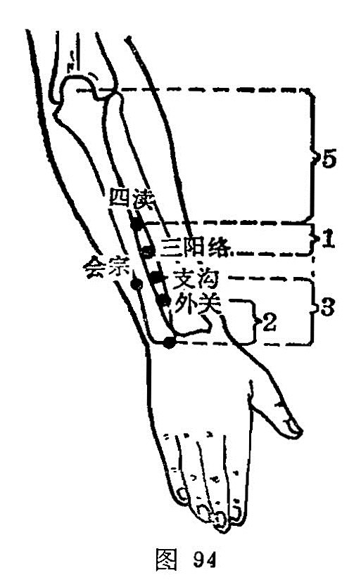

##### 四渎

〔定位〕肘尖下方5寸，尺、桡骨之间取之（图94）。

〔解剖〕在指总伸肌腱和尺侧腕伸肌之间，深层有前臂骨间背侧动、静脉；布有前臂背侧皮神经，深层有臂骨间背侧神经。

〔功能〕清咽利耳。

〔主治〕暴暗，耳聋，齿痛，咽干如梗，前臂痛。

〔刺灸〕直刺0.5~1寸。可灸。

〔讲述〕见于《甲乙》。沟渠为渎，穴在两骨之间凹陷处，经气从此通过，形似水渎，昔以江、淮、河、汉四水为渎，而三焦为决渎之官，水道出焉，故在三阳络之下，设一穴，名为四读。《甲乙》：治卒气聋，齿痛。《千金》治呼吸气短，咽中如息肉状。临床常配廉泉治失音，配天牖治耳暴聋，配液门治呼吸气短。

