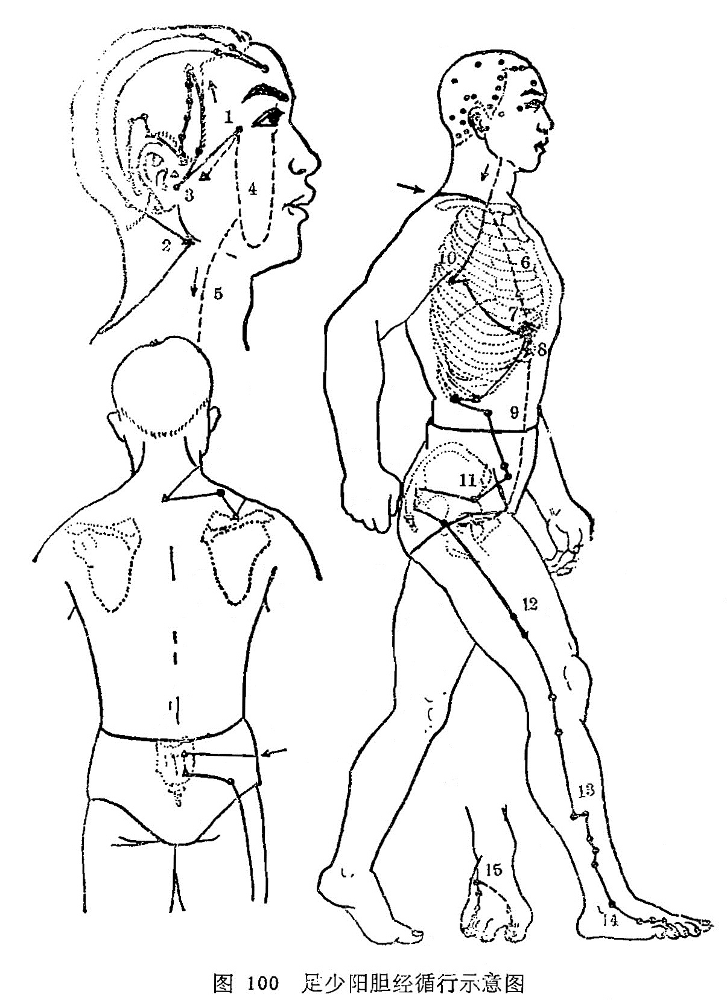

#### （一）分布络属

分布径路：受手少阳三焦经之交，从外眼角起始，向上到达头角部，再向下到耳后，沿着头颈，行走在手少阳经的前面，到肩上在第7颈椎棘突下左右相交，退回来向前进入锁骨上窝。

它的支脉，从耳后进入耳中，出耳前，到外眼角的后面。

它的又一支脉，从外眼角发出，向下到足阳明的大迎穴附近，和手少阳经分布在面颊部支脉相合并，一起达眼下；下边经过下颌角部，下行到颈部，和主干在锁骨上窝部会合后，进入体腔，贯穿膈肌，联络肝，归属于胆，沿着胁肋的里边，浅出腹股沟中央的气街部，绕过阴毛边际，横向进入股骨大转子部。

外行主干，从锁骨上窝部下行到腋窝下，沿着胸侧，经过浮肋，下行和前面的支脉在股骨大转子部合并，再向下沿着大腿外侧、膝关节外缘，行走在腓骨之前面，直下到腓骨下端浅出外踝的前面，沿着足背，进入足第4趾外侧趾縫到末端。

它的分支，从足背上分出，进入足大趾趾缝，沿第1、第2跖骨之间，出足大趾外侧端。回过来贯串爪甲，分布在足大趾背上的丛毛部，交于足厥阴肝经（图100）。

本经脉气从阳陵泉穴处合入于胆腑。

络属脏腑：属胆，络肝。

经过器官：眼，耳。

本经腧穴：

十一胆经足少阳，从头走足行身旁。

外眦五分**瞳子髎**，听会耳前珠陷详。

**上关**上行一寸是，内斜曲角**颌厌**当。

**悬颅悬厘**近头维，相距半寸君勿忘。

**曲鬓**耳前发际标，入发寸半**率谷**交。

**天冲**率后斜五分，**浮白**率下一寸绕。

**窍阴**穴在枕骨上，**完骨**耳后发际好。

**本神**神庭三寸旁，**阳白**眉上一寸量。

入发五分**头临泣**，庭维之间取之良。

**目窗正营**及**承灵**，相距寸半**脑空**招。

**风池**耳后发际陷，颅底筋外有陷凹。

**肩井**缺盆上寸半，**渊液**腋下三寸从。

**辄筋**腋前横一寸，**日月**乳下三肋逢。

**京门**十二肋骨端，**带脉**章下一寸八。

**五枢**带下三寸取，枢下五分**维道**见。

**居髎**维后斜三寸，**环跳**髀枢陷中间。

**风市**垂手中指处，**中渎**膝上五寸陈。

**阳关**陵上膝髌外，腓骨头前**阳陵泉**。

**阳交**外踝上七寸，**外丘**踝上七寸云。

二穴相平堪比较，丘前交后距五分。

**光明**踝五阳辅四，踝上三寸**悬钟**寻。

踝前陷中**丘墟**闻，**临泣**四趾本节扪。

临下五分**地五会**，本节之前**侠溪**匀。

四趾外端**足窍阴**，四十四穴仔细吟。

图100足少阳胆经循行示意图

图解：胆足少阳之脉，①起于目锐眦，上抵头角，下耳后，②循颈，行手少阳之前，至肩上，却交出手少阳之后，入缺盆。其支者，③从耳后入耳中，出走耳前，至目锐眦后，其支者， ④别锐眦，下大迎， 合于手少阳抵于䪼（zhuō，出页），⑤下行颊车，下颈，合缺盆。⑥以下胸中，贯膈，⑦络肝，⑧属胆，⑨循胁里，出气街，绕毛际， 横入髀厌中；其直者， ⑩从缺盆下腋，循胸，过季胁，⑪下合髀厌中⑫以下循髀阳，出膝外廉，⑬下外辅骨之前，直下抵绝骨之端，下出外踝之前， ⑭循足跗，上入小趾次趾之间，其支者，⑮别跗上，入大趾之间，循大趾歧骨内出其端，还贯爪甲，出三毛（《灵枢·经脉》）。胆合入于阳陵泉（《灵枢·邪气脏腑病形》）。
