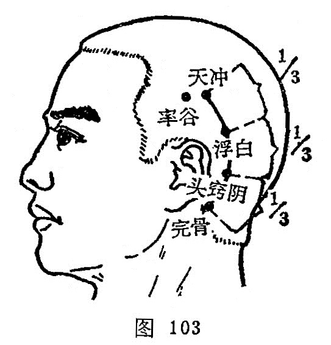

##### 浮白

〔定位〕耳后乳突后上方，当天冲与完骨弧形连线的上1/3折点处（图103）。

〔解剖〕有耳后动、静脉分支；布有耳大神经之分支。

〔功能〕祛风解表，行瘀理气。

〔主治〕头项强痛，寒热咳逆，耳鸣耳聋，目痛，瘿气。

〔刺灸〕平刺0.5~0.8寸。可灸。

〔讲述〕出《素问·气穴论》。浅表为浮，白色应肺，本穴主治肺疾寒热，针之有宣肺解表之效，因名。穴属足太阳、少阳之会。《铜人》：治寒热喉痹，咳逆痰沫，胸中满不得喘息，耳鸣嘈嘈无所闻，颈项痈肿及瘿气，肩臂不举。临床常配风池、太阳、外关治偏头痛，配完骨治齿牙齲痛。本穴所以能治癭气，是因穴属胆经，为足太阳膀胱会所，经脉又循颈，至肩，走入锁骨上窝，而膀胱又行于颈项之后，故刺此则能消除项肿瘿气。

