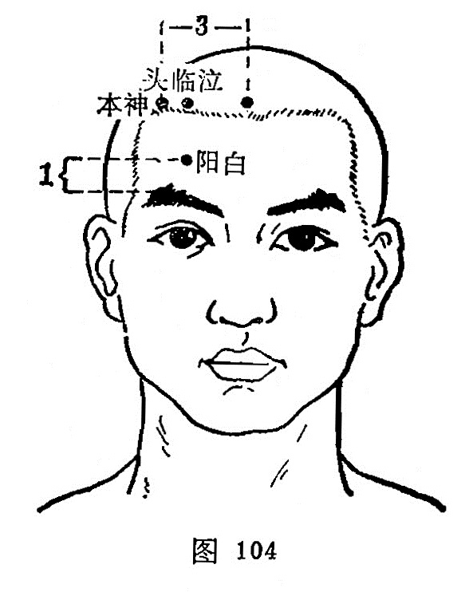

##### 本神

〔定位〕前发际内0.5寸，神庭旁开3寸（图104）。

〔解剖〕在额肌中，有额浅动、静脉额支，额动，静脉外侧支，当额神经外侧支处。

〔功能〕清热止痛，镇静安神。

〔主治〕头痛，目眩，颈项强痛，癫痫，小儿惊风，半身不遂。

〔刺灸〕平刺0.5~0. 8寸。可灸。

〔讲述〕见于《甲乙》。别称直耳。本有宗的含意，穴当神庭旁3寸，主治惊痫癫疾，神不守舍，针之可达镇静安神之效，因名。穴属少阳、阳维之会。《大成》：治惊痫吐涎沫，颈項强急痛，目眩，胸相引不得转侧，痫疾呕吐涎沫，偏风。临床常配心俞、大陵、合谷治癫痫，配百会、人中、十宣治中风不省人事，配神庭、攒竹、合谷治前头痛。

