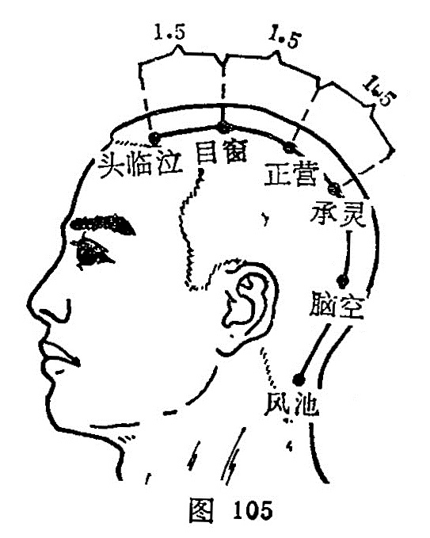

##### 头临泣

〔定位〕阳白直上，入发际0.5寸（图104、105）。

〔解剖〕在额肌中，有额动、静脉；布有额神经内外支会合支。

〔功能〕泻热祛风，清脑明目。

〔主治〕头痛，目眩，目翳，流泪。

〔刺灸〕平刺0.5~0.8寸。可灸。

〔讲述〕见于《甲乙》。 临，指居高视下之意；泣，指泪水。穴当头部目之上方，居高临下，当人泣时，痠楚临其穴处，上液之道开则泣下，因名。本穴为足少阳、足太阳膀胱和阳维脉之会。长于治目、鼻之疾。《甲乙》：治颊清，不能视，口沫泣出，两目眉头痛。《通玄）：治眵䁾冷泪临泣尤佳。《拦江赋》：眼目之症诸疾苦，更须临泣用针担。临床常配攒竹、瞳子髎、合谷治目翳流泪，配肝俞、头维治目泣出，配肝俞治白翳。配头维、丝竹空、攒竹治口眼歪斜，前额肌麻痹；配中渚治目眩。

