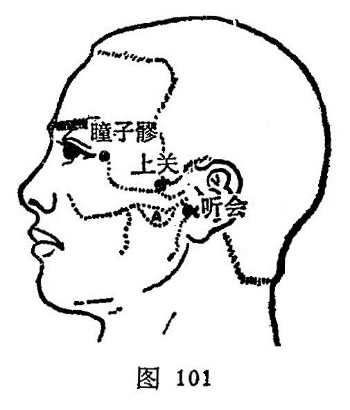

##### 听会

〔定位〕耳屏间切迹前，听宫下方，下颌骨髁状突后缘，张口有空处（图101）。

〔解剖〕有颞浅动脉耳前支，深部为颈外动脉及面后静脉，布有耳大神经，皮下为面神经。

〔功能〕益聪利耳，通经活络。

〔主治〕耳鸣，耳聋，齿痛，口㖞，腮肿，下颌脱臼，头痛，面痛。

〔刺灸〕张口直刺0.5~1寸。可灸。

〔讲述〕见干《甲乙》。别称耳门、听呵。会有聚的含意，耳主听觉，穴当耳前，主治耳聋气闭，针此可使听觉得以会聚，因名。本穴除主耳疾外，还可用于齿痛、口㖞之疾。《甲乙》：言治，其目泣出，头不痛者。聋，耳中颠飕风，颠飕者，若风。《千金翼》：治耳中如蝉鸣，牙车急及脱臼。《大成》：治耳鸣耳聋，牙车脱臼，牙车急不得嚼物，齿痛恶寒，狂走瘈疭，恍惚不乐，中风口蜗斜，手足不遂。用泻法，能消散郁热，清宣耳窍，治实热性耳鸣聋。临床配丘墟、太冲能清泻肝胆之火，治肝胆之火循经上扰所致之失聪；配内庭、丰隆清降痰火，治蕴痰化火上扰壅阻清窍之耳鸣聋；配外关、合谷疏风清热，清宣耳窍，治外感风热之耳鸣聋，配神庭、风池、内关、合谷治耳原性眩晕；配翳风、颊车、地仓、上关、下关治中风口眼㖞斜。

