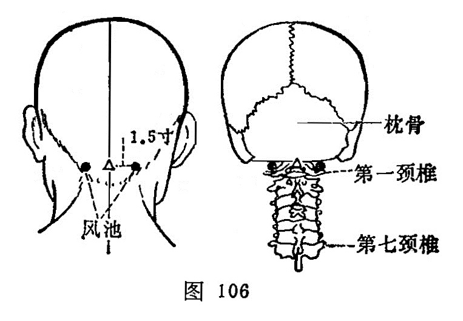

##### 风池

〔定位〕项后，当胸锁乳突肌与斜方肌上端之间的凹陷中，横平[风府](https://www.gmzyjc.com/read/zjs/zjs3.2.2-0.0.1.3.16.md)穴（106）。

〔解剖〕在胸锁乳突肌和斜方肌上端之间，深层为头夹肌，有枕动、静脉分支；布有枕小神经之支。

〔功能〕祛风解表，清头明目。

〔主治〕头项强痛，眩晕，目赤痛，鼻渊，气闭耳聋，中风，热病，感冒。

〔刺灸〕向鼻尖方向刺0.5~0.8寸。可灸。

〔讲述〕出《灵枢·热病》。别称热府。风指病邪，池有浅的含意，穴属足少阳、三焦、阳维之会，为风邪易侵之所，主治风邪为患，为搜风之要穴，因名。考高巅之上，惟风可到，伤于风，上先受之，而肝亢、痰浊，风挟其邪亦易上扰清窍，引起头、脑、目、耳病，加之阳维脉维络诸阳，并会于督脉，与足太阳、足少阳经依附更为密切，因此，手足少阳、阳维之会[风池](https://www.gmzyjc.com/read/zjs/zjs3.1.9-12-0.0.3.3.20.md)，可治一切风邪为患。临床常配[合谷](https://www.gmzyjc.com/read/zjs/zjs3.1.1-3-0.1.2.3.4.md)、[外关](https://www.gmzyjc.com/read/zjs/zjs3.1.9-12-0.0.2.3.5.md)疏散风热，可止风挟热邪之头痛；配[百会](https://www.gmzyjc.com/read/zjs/zjs3.2.2-0.0.1.3.20.md)、[列缺](https://www.gmzyjc.com/read/zjs/zjs3.1.1-3-0.1.1.3.7.md)疏散风寒，可止风挟寒邪之头痛；配[阴陵泉](https://www.gmzyjc.com/read/zjs/zjs3.1.4-6-0.0.1.3.9.md)祛风胜湿，可止风挟湿邪之头痛；配[太冲](https://www.gmzyjc.com/read/zjs/zjs3.1.9-12-0.0.4.3.3.md)、[复溜](https://www.gmzyjc.com/read/zjs/zjs3.1.7-8-0.0.2.3.7.md)能镇肝熄风，可治肝亢之头痛；配[丰隆](https://www.gmzyjc.com/read/zjs/zjs3.1.1-3-0.1.3.3.40.md)、[阴陵泉](https://www.gmzyjc.com/read/zjs/zjs3.1.4-6-0.0.1.3.9.md)健脾祛痰，可治痰浊上扰之头痛；配太阳，[丘墟](https://www.gmzyjc.com/read/zjs/zjs3.1.9-12-0.0.3.3.40.md)清宣少阳，可治胆火上扰之偏头痛。用治眩晕可配[太冲](https://www.gmzyjc.com/read/zjs/zjs3.1.9-12-0.0.4.3.3.md)、[丘墟](https://www.gmzyjc.com/read/zjs/zjs3.1.9-12-0.0.3.3.40.md)泻肝火，潜阳熄风；配[太冲](https://www.gmzyjc.com/read/zjs/zjs3.1.9-12-0.0.4.3.3.md)、[复溜](https://www.gmzyjc.com/read/zjs/zjs3.1.7-8-0.0.2.3.7.md)镇肝熄风治水不涵木，肝阳偏亢之眩晕；配[神门](https://www.gmzyjc.com/read/zjs/zjs3.1.4-6-0.0.2.3.7.md)、[三阴交](https://www.gmzyjc.com/read/zjs/zjs3.1.4-6-0.0.1.3.6.md)补益心脾，治心虚血少之眩晕；配[丰隆](https://www.gmzyjc.com/read/zjs/zjs3.1.1-3-0.1.3.3.40.md)、[内庭](https://www.gmzyjc.com/read/zjs/zjs3.1.1-3-0.1.3.3.44.md)清降痰火，治痰郁化火之眩晕；配[阴陵泉](https://www.gmzyjc.com/read/zjs/zjs3.1.4-6-0.0.1.3.9.md)、[丰隆](https://www.gmzyjc.com/read/zjs/zjs3.1.1-3-0.1.3.3.40.md)健脾祛痰，治痰湿上蒙清窍之眩晕；配[肾俞](https://www.gmzyjc.com/read/zjs/zjs3.1.7-8-0.0.1.3.23.md)、[太溪](https://www.gmzyjc.com/read/zjs/zjs3.1.7-8-0.0.2.3.3.md)补益肾精，治髓海不足之眩晕症。用治目疾、赤痛可配[睛明](https://www.gmzyjc.com/read/zjs/zjs3.1.7-8-0.0.1.3.1.md)、太阳（出血），凡风热加刺[合谷](https://www.gmzyjc.com/read/zjs/zjs3.1.1-3-0.1.2.3.4.md)。青盲可配光明、[行间](https://www.gmzyjc.com/read/zjs/zjs3.1.9-12-0.0.4.3.2.md)清肝利胆，治肝胆风热所致之青盲；配[丘墟](https://www.gmzyjc.com/read/zjs/zjs3.1.9-12-0.0.3.3.40.md)、[行间](https://www.gmzyjc.com/read/zjs/zjs3.1.9-12-0.0.4.3.2.md)平肝潜阳，治肝亢所致之青盲；配[曲泉](https://www.gmzyjc.com/read/zjs/zjs3.1.9-12-0.0.4.3.8.md)、[复溜](https://www.gmzyjc.com/read/zjs/zjs3.1.7-8-0.0.2.3.7.md)养肝明目，治肝阴不足所致之青盲。用治失眠，可配[神门](https://www.gmzyjc.com/read/zjs/zjs3.1.4-6-0.0.2.3.7.md)、[三阴交](https://www.gmzyjc.com/read/zjs/zjs3.1.4-6-0.0.1.3.6.md)补益心脾，治心脾血亏之失眠；配[神门](https://www.gmzyjc.com/read/zjs/zjs3.1.4-6-0.0.2.3.7.md)、[复溜](https://www.gmzyjc.com/read/zjs/zjs3.1.7-8-0.0.2.3.7.md)滋阴降火，交通心肾，治心肾不交之失眠；配[丰隆](https://www.gmzyjc.com/read/zjs/zjs3.1.1-3-0.1.3.3.40.md)、[内庭](https://www.gmzyjc.com/read/zjs/zjs3.1.1-3-0.1.3.3.44.md)清降痰火，治痰火上扰之失眠。顽固性失眠，可行皮下埋针法。用治痫症，可配[神门](https://www.gmzyjc.com/read/zjs/zjs3.1.4-6-0.0.2.3.7.md)、[丰隆](https://www.gmzyjc.com/read/zjs/zjs3.1.1-3-0.1.3.3.40.md)、[太冲](https://www.gmzyjc.com/read/zjs/zjs3.1.9-12-0.0.4.3.3.md)熄风定痫，豁痰宣窍。治癔病可配[天柱](https://www.gmzyjc.com/read/zjs/zjs3.1.7-8-0.0.1.3.10.md)、[大椎](https://www.gmzyjc.com/read/zjs/zjs3.2.2-0.0.1.3.14.md)、[印堂](https://www.gmzyjc.com/read/zjs/zjs3.4-0.1.1.2.0.md)，凡失明可配光明清脑明目。

刺本穴可向鼻尖方向刺，不可向内上方刺入过深，深刺伤及延髓，发生内出血，可导致生命[中枢](https://www.gmzyjc.com/read/zjs/zjs3.2.2-0.0.1.3.7.md)瘫痪而死亡。《素问·刺禁论》：刺头中[脑户](https://www.gmzyjc.com/read/zjs/zjs3.2.2-0.0.1.3.17.md)，入脑立死。
