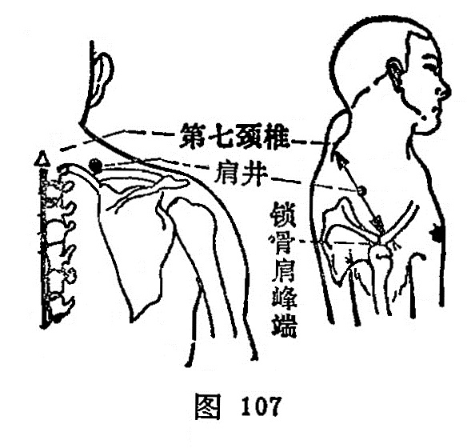

##### 肩井

〔定位〕在肩上，当大椎（督脉）与肩峰连线的中点处（图107）。

〔解剖〕有斜方肌，深层为肩胛提肌与冈上肌，有颈横动、静脉分支；布有锁骨上神经后支，副神经和肩胛背神经下支。

〔功能〕通经理气，豁痰开郁。

〔主治〕头项强痛，肩背痛，手臂不举，乳痈，乳汁不下，滞产，中风、疔疮。

〔刺灸〕直刺0.5~0.8寸，切忌深刺，捣刺。可灸。

〔讲述〕见于，《甲乙》。别称髆井。凹陷深处为井，穴在肩上陷中，适当缺盆上，大骨前，因名。穴属足少阳、阳维之会。《甲乙》治肩背痹痛，臂不举，寒热凄索。《大成》：治中风，气塞涎上不语，气逆，妇人难产，堕胎后手足厥逆。临床常配天宗、肩髃治肩背痛，配曲池、下廉治手臂冷痛。配乳根、足三里治乳汁不下，乳痈；配曲池、大迎治瘰疬。《图翼》：孕妇禁针。《席弘赋》：若针肩井须三里，不刺之时气未调。这是因为本穴连入五脏气，若刺深则令人闷倒不识人（《铜人》），易发生晕针。
