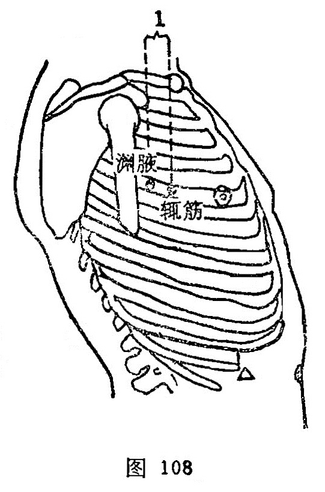

##### 辄筋

〔定位〕渊腋前1寸，第4肋间隙，侧卧取穴（图108）。

〔解剖〕在胸大肌外缘，有前锯肌，肋间内外肌，有胸外侧动、静脉；布有第4肋间神经外侧皮支。

〔功能〕理气平喘，活血止痛。

〔主治〕胸满，胁痛，气喘，腋肿，肩臂痛。

〔刺灸〕斜刺0.5~0.8寸。可灸。

〔讲述〕见于《甲乙》。辄为不动貌，又指车前，因穴主治四肢不收，胸满喘息，加之穴在肋间，肋骨排列有如辄迹，因名。穴属足太阳、少阳之会。《铜人》：治胸中暴满不得卧，喘息。《大成》：治胸中暴满不得卧，太息善悲，小腹热，欲走，多唾，言语不正，四肢不收，呕吐宿食，吞酸。临床常配内关、中脘、脾俞、胃俞治宿食吞酸，呕吐；配膻中、期门、支沟、肝俞治胁痛。

