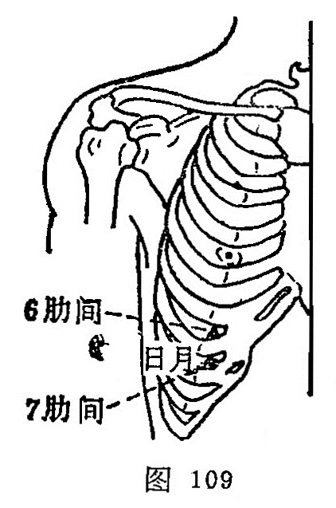

##### 日月

〔定位〕乳头下方，第7肋间隙取之（图109）。

〔解剖〕有肋间内外肌，肋下缘有腹外斜肌腱膜，腹内斜肌，腹横肌，有肋间动、静脉；布有第八肋间神经。

〔功能〕开郁止痛，降逆利胆。

〔主治〕胁肋疼痛，胀满，呕吐，吞酸，呃逆，黄疸。

〔刺灸〕斜刺0.5~0.8 寸。可灸。

〔讲述〕见于《甲乙》。别称神光、胆募。穴属胆募，胆主决断，决断务求其明，明字从日、月，因名。穴属胆募，又为足太阴、少阳之会。《甲乙》：治太息善悲，少腹有热欲走。《千金》：治呕吐宿食吞酸。临床常配[期门](https://www.gmzyjc.com/read/zjs/zjs3.1.9-12-0.0.4.3.14.md)、[阳陵泉](https://www.gmzyjc.com/read/zjs/zjs3.1.9-12-0.0.3.3.34.md)、[肝俞](https://www.gmzyjc.com/read/zjs/zjs3.1.7-8-0.0.1.3.18.md)、[行间](https://www.gmzyjc.com/read/zjs/zjs3.1.9-12-0.0.4.3.2.md)治胁痛，黄疸；配[内关](https://www.gmzyjc.com/read/zjs/zjs3.1.9-12-0.0.1.3.6.md)治呃逆；配[大横](https://www.gmzyjc.com/read/zjs/zjs3.1.4-6-0.0.1.3.15.md)治少腹热欲走，太息。刺本穴宜斜或平刺，不可深直刺，免伤内脏。
