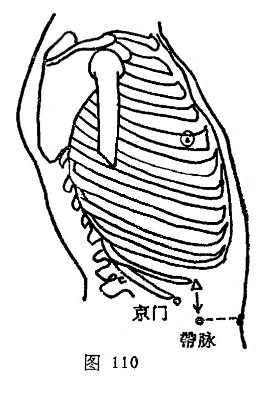

##### 京门

〔定位〕侧卧，于侧腹部，当12肋骨游离端下际取穴（图110）。

〔解剖〕有腹内外斜肌及腹横肌，有第十一肋间动、静脉；布有第十一肋间神经。

〔功能〕益肾，利水。

〔主治〕腹胀，肠鸣，泄泻，腰痛，小便不利。

〔刺灸〕斜刺0.5~0.8寸。可灸。

〔讲述〕见于《甲乙》。 别称气府，气俞、肾募。京指都，又指发源之地，出入之处为门，穴属肾募，肾为人体元气之本源，而本穴主治[水道](https://www.gmzyjc.com/read/zjs/zjs3.1.1-3-0.1.3.3.28.md)不利，为水液之门户，因名。《甲乙》：治溢饮，[水道](https://www.gmzyjc.com/read/zjs/zjs3.1.1-3-0.1.3.3.28.md)不通，溺黄，小腹痛，里急肿，洞泄，体痛引背。由于肾为水火之脏，肾气盛则水液排泄正常，反之肾气郁滯，影响肝木疏泄，则病腹胀，肠鸣，泄泻；水液排出障碍则病水肿，小便不利，刺肾募可益肾，利水。临床常配[关元](https://www.gmzyjc.com/read/zjs/zjs3.2.1-0.1.1.3.4.md)，[复溜](https://www.gmzyjc.com/read/zjs/zjs3.1.7-8-0.0.2.3.7.md)治水肿；配[照海](https://www.gmzyjc.com/read/zjs/zjs3.1.7-8-0.0.2.3.6.md)治尿黄[水道](https://www.gmzyjc.com/read/zjs/zjs3.1.1-3-0.1.3.3.28.md)不通；配[蠡沟](https://www.gmzyjc.com/read/zjs/zjs3.1.9-12-0.0.4.3.5.md)、[中封](https://www.gmzyjc.com/read/zjs/zjs3.1.9-12-0.0.4.3.4.md)治小腹肿；配[天枢](https://www.gmzyjc.com/read/zjs/zjs3.1.1-3-0.1.3.3.25.md)、[阴陵泉](https://www.gmzyjc.com/read/zjs/zjs3.1.4-6-0.0.1.3.9.md)治腹胀，泄泻；配[肾俞](https://www.gmzyjc.com/read/zjs/zjs3.1.7-8-0.0.1.3.23.md)、[委中](https://www.gmzyjc.com/read/zjs/zjs3.1.7-8-0.0.1.3.40.md)、[三阴交](https://www.gmzyjc.com/read/zjs/zjs3.1.4-6-0.0.1.3.6.md)治肾虚腰痛。刺本穴不可过深，免伤内脏。

