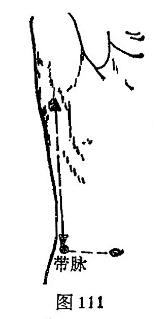

##### 带脉

〔定位〕侧卧，第11肋骨游离端直下（京门）与脐相平处取穴；或腋窝中点直下与脐相平处（图110、111）。

〔解剖〕有腹内外斜肌及腹横肌，有第12肋间动静脉；布有第12肋间神经。

〔功能〕调理经带。

〔主治〕月经不调，赤白带下，疝气，腰胁痛，经闭腹痛。

〔刺灸〕直刺0.5~0.8寸。 可灸。

〔讲述〕出《灵枢·癫狂》。穴属胆经，位居季胁，为带脉经气所过处，因名。本穴除主经、带之疾外，还可用治癫疾、瘈疭、疝气。《甲乙》：治妇人少腹坚痛，月水不通。《大成》：治腰腹纵，溶溶如囊水之状，妇人小腹痛，里急后重，瘈疭，月事不调，赤白带下。《金鉴》：治疝气，偏坠木肾及妇人赤白带下。临床常配地机、漏谷治赤白带下；配血海治月经不调；配侠谿治小腹坚痛、月水不通； 配三阴交、关元、归来治阴挺。

