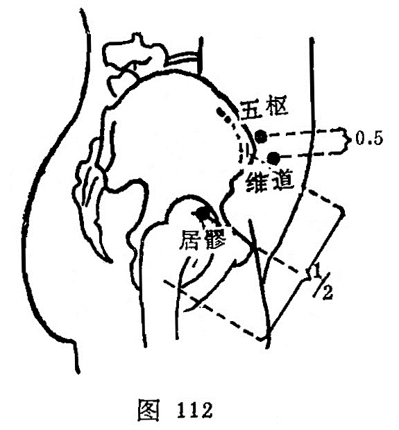

##### 维道

〔定位〕在五枢前下0.5寸处（图112）。

〔解剖〕有腹内外斜肌和腹横肌，有旋髂浅深动、静脉；布有髂腹股沟神经。

〔功能〕调理任、冲、带脉。

〔主治〕少腹痛，腰胯痛，阴挺，疝气，带下，月经不调。

〔刺灸〕向前下方斜刺0.8~1.5寸。可灸。

〔讲述〕见于《甲乙》。别称外枢。联接为维，又有系的含意；道指通路。穴属胆经，为带脉之会所，因名。本穴除主带下、阴挺之疾外，还可用治三焦不调，水肿不食。《甲乙》：治咳逆不止，三焦有水气，不能食。《铜人》：治呕逆不止，三焦不调，水肿，不嗜食。临床常配肾俞、关元、三阴交治月经不调，带下；配归来、三阴交治阴挺；配大敦、三阴交治疝气。

