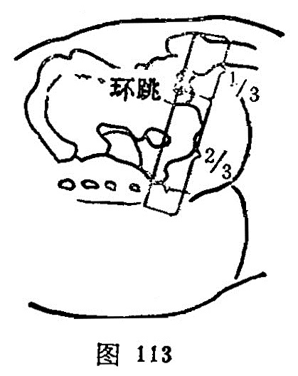

##### 环跳

〔定位〕股骨大转子与骶管裂孔连线的外1/3折点处，侧卧屈股取穴；或微屈掌，小指掌关节按在股骨大转子顶端，下按，当拇指尖到达处是穴（图113、114）。

〔解剖〕在臀大肌，梨状肌下缘，内侧为臀下动、静脉；布有臀下皮神经，臀下神经，深部正当坐骨神经。

〔功能〕祛风湿，利腰腿。

〔主治〕下肢风湿痹痛，瘫痪，腰胯痛，膝胫痛。

〔刺灸〕直刺1.5~2.5寸。可灸。

〔讲述〕见于《甲乙》。别称髀厌、髀枢。穴当髀枢，人患腿部风痹则不能伸屈跳跃，针此疾去，可使其跳跃，如常；加之取该穴时，必须伸下腿，屈上腿，旋转髀枢，形似跳跃，始得其穴，因名。穴属足少阳、太阳二脉之会所。本穴主要用治风湿痹痛，下肢瘫痪，胫痛不可屈伸，痹不仁。《天星》：环跳在髀枢，侧卧屈足取，折腰莫能顾，冷风并湿痹，腿胯连腨痛，转折重欷歔，若人针灸后，顷刻病消除。治下肢痛，痿症。临床可根据疼痛部位，选配风市、阳陵泉、丘墟以循足少阳经痛；配殷门、委中、昆仑以循足太阳经痛。若因肝气郁结，气滞经脉，加行间以行气散滞；血络瘀滞加三阴交、血海以行血散瘀；气血不足加合谷、三阴交补气益血。若风盛加曲池、阴陵泉以祛风散湿；脾虚加足三里、脾俞健脾逐湿；肝肾亏虚，筋脉失养，加肾俞、太溪补益肝肾；湿热交结加阴陵泉、合谷、三阴交清利湿热；寒盛加补关元俞、肾俞温补肾阳，扶正驱寒。

髀枢处肌肉丰满，进针浅深，因人而异。但以“惟视病之浮沉，而为刺之深浅”，达到“谷气至而止”；又此处肌肉丰厚，下肢易移动，故多发生弯针、折针。
