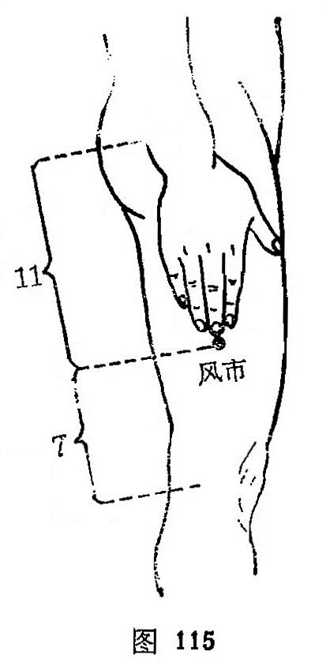

##### 风市

〔定位〕大腿外侧中线上，距膝上7寸，直立垂手时，中指尖着处是穴（图115）。

〔解剖〕在阔筋膜下，股外侧肌中，旋股外侧动、静脉肌支；布有股外侧皮神经，股神经肌支。

〔功能〕祛风湿，疏经络。

〔主治〕半身不遂，下肢痿痹，麻木，遍身瘙痒。

〔刺灸〕直刺1~1.5寸。可灸。

〔讲述〕见于《肘后》。别称垂手。市有集结之意，因本穴主治因风气集结而致风痹不仁，偏风半身不遂等，本穴是祛风的要所，因名。临床用治下肢疼痛，痛在髋股可配环跳，膝股痛配腰阳关、阳陵泉，气血瘀滑加三阴交、血海，因气血两亏可补合谷、三阴交益气养血，因湿热阻络可配阴陵泉、足三里清利湿热。用治下肢麻木，凡股部沿足少阳配环跳、膝阳关、阳陵泉，股外侧麻木加刺局部穴，使之出血，以行血散瘀。如因气血不足加合谷补气，血海养血；气滞血瘀加间使、血海行气散瘀。用治下肢痿症，可选配阳陵泉、绝骨、足三里、三阴交、环跳祛邪扶正，壮筋补虚；如因津液不足，筋失所养者，加尺泽、内庭清热，补复溜以养阴；如湿热浸淫，筋脉弛缓加阴陵泉以祛湿，刺曲池以清利湿热；如脾虚湿盛加阴陵泉、足三里、太白、脾俞健脾利湿；气血不足加合谷、三阴交补益气血。用治瘙痒可配外关、曲池清热散风，血海、三阴交养血除风止痒。。
