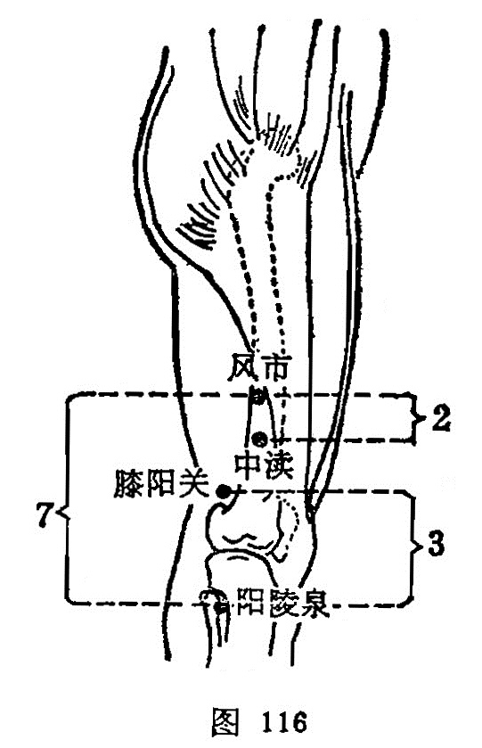

##### 膝阳关

〔定位〕阳陵泉上3寸，股骨外上髁的上方凹陷处（图116）。

〔解剖〕在髂胫束后方，股二头肌腱前方，有膝上外侧动、静脉；布有股外侧皮神经末支。

〔功能〕疏筋脉，利关节。

〔主治〕膝髌肿痛，腘筋挛急，小腿麻木。

〔刺灸〕直刺0.8~1寸。可用艾卷灸。

〔讲述〕见于《甲乙》。别称寒府、关阳、关陵。穴属胆经，位于阳陵泉上3寸，适当膝关节外侧陷中，以外为阳，因名。《甲乙》：用治膝外廉痛，不可屈伸，胫痹不仁。《千金》：主筋挛，膝不得屈伸。临床常配环跳、承筋治胫痹不仁；配梁丘、足三里、膝眼、鹤顶治膝关节痛。

