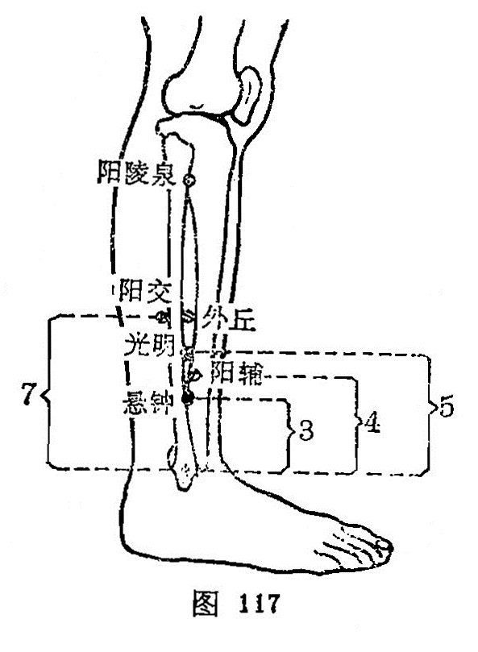

##### 阳交

〔定位〕外踝高点上7寸，腓骨后缘，当外踝与[阳陵泉](https://www.gmzyjc.com/read/zjs/zjs3.1.9-12-0.0.3.3.34.md)之间（图117）。

〔解剖〕在腓骨长肌附着部，有腓动、静脉分支；布有腓肠外侧皮神经。

〔功能〕疏肝利胆，定惊安神。

〔主治〕胸胁胀满，面肿，下肢痿痹，癫狂惊痫，膝股痛。

〔刺灸〕直刺0.5~0.8寸。可灸。

〔讲述〕见于《甲乙》。别称别阳、足髎。交指会，穴属足少阳、阳维之会，又系阳维之郄，因名。本穴除主足胫瘘痹、惊狂胸满外，还可用治喉痹心悸。《甲乙》：治寒热，癫疾，惊狂， 瘖不能言，髀胫不收。《千金》：治喉痹，胸满。临床常配[太冲](https://www.gmzyjc.com/read/zjs/zjs3.1.9-12-0.0.4.3.3.md)治胸胁胀满；配[悬钟](https://www.gmzyjc.com/read/zjs/zjs3.1.9-12-0.0.3.3.39.md)、[梁丘](https://www.gmzyjc.com/read/zjs/zjs3.1.1-3-0.1.3.3.34.md)、[犊鼻](https://www.gmzyjc.com/read/zjs/zjs3.1.1-3-0.1.3.3.35.md)、[足三里](https://www.gmzyjc.com/read/zjs/zjs3.1.1-3-0.1.3.3.36.md)冶膝胫痛；配[解溪](https://www.gmzyjc.com/read/zjs/zjs3.1.1-3-0.1.3.3.41.md)治惊悸、怔仲，有清热宁神之效。

