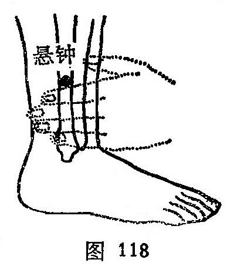

##### 悬钟

〔定位〕外踝上3寸，当腓骨前缘与腓骨短肌肌腹之间凹陷处；外踝尖上四横指处（图117、 118）。

〔解剖〕在腓骨短肌与趾长伸肌分歧处，有胫前动、静脉分支；布有腓浅神经。

〔功能〕通经活络，坚筋壮骨。

〔主治〕颈项强痛，半身不遂，足胫挛痛，脚气，胸腹胀满，胁痛。

〔刺灸〕直刺0.5~0.8寸。可灸。

〔讲述〕见于《甲乙》。别称绝骨。悬指挂，穴当足外踝上3寸，昔时常有小儿于此处悬带响铃似钟，因名。穴为髓会，配骨之会[大杼](https://www.gmzyjc.com/read/zjs/zjs3.1.7-8-0.0.1.3.11.md)能充养骨骼治疗髓虚不足所致之骨痿，腰痠胫软，以及下肢痿软、软骨病等，有壮骨补髓之效。由于肾主骨、藏精、生髓，故凡肾精亏损，可配[肾俞](https://www.gmzyjc.com/read/zjs/zjs3.1.7-8-0.0.1.3.23.md)、[太溪](https://www.gmzyjc.com/read/zjs/zjs3.1.7-8-0.0.2.3.3.md)益肾精，佐用[大杼](https://www.gmzyjc.com/read/zjs/zjs3.1.7-8-0.0.1.3.11.md)壮骨补髓治痿症；如病在上肢加[曲池](https://www.gmzyjc.com/read/zjs/zjs3.1.1-3-0.1.2.3.11.md)以通经脉；若肾阴虚，精液枯可加补[复溜](https://www.gmzyjc.com/read/zjs/zjs3.1.7-8-0.0.2.3.7.md)滋肾阴，[肾俞](https://www.gmzyjc.com/read/zjs/zjs3.1.7-8-0.0.1.3.23.md)益骨髓，[太溪](https://www.gmzyjc.com/read/zjs/zjs3.1.7-8-0.0.2.3.3.md)益肾阴；若肾阴不足，肝失所养，筋骨受损，则筋痿弛纵不收，可补[曲泉](https://www.gmzyjc.com/read/zjs/zjs3.1.9-12-0.0.4.3.8.md)养肝益筋，[肾俞](https://www.gmzyjc.com/read/zjs/zjs3.1.7-8-0.0.1.3.23.md)、[太溪](https://www.gmzyjc.com/read/zjs/zjs3.1.7-8-0.0.2.3.3.md)填精补髓，加[三阴交](https://www.gmzyjc.com/read/zjs/zjs3.1.4-6-0.0.1.3.6.md)益脾养血；若痿症软骨出现内翻足者，可加刺补[申脉](https://www.gmzyjc.com/read/zjs/zjs3.1.7-8-0.0.1.3.62.md)、[昆仑](https://www.gmzyjc.com/read/zjs/zjs3.1.7-8-0.0.1.3.60.md)、[丘墟](https://www.gmzyjc.com/read/zjs/zjs3.1.9-12-0.0.3.3.40.md)以健筋脉，兼泻内侧[照海](https://www.gmzyjc.com/read/zjs/zjs3.1.7-8-0.0.2.3.6.md)、[太溪](https://www.gmzyjc.com/read/zjs/zjs3.1.7-8-0.0.2.3.3.md)、[三阴交](https://www.gmzyjc.com/read/zjs/zjs3.1.4-6-0.0.1.3.6.md)以解除内侧经筋之拘急；足外翻，系属足外侧经筋拘急或内侧弛缓所致，可用上穴，但补泻相反进行治疗即可。

由于穴属“足三阳大络”，足三阳经脉皆循行于颈项部，故对颈项部不能左右回顾之项强痛，刺之可通络止痛，再配[风池](https://www.gmzyjc.com/read/zjs/zjs3.1.9-12-0.0.3.3.20.md)宣畅少阳之壅滞，可立止疼痛。由于脑为髓之海，髓之会在绝骨，故对髓海不足所引起的头痛、眩晕、健忘、耳鸣之疾，刺之可收益髓健脑之效。
