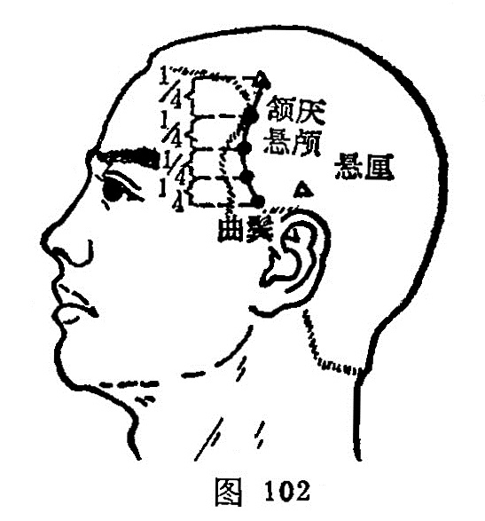

##### 颔厌

〔定位〕在鬓发中，当头维与曲鬓连线的上1/4与下3/4交界处（图102）。

〔解剖〕在颞肌中，有颞浅动、静脉额支；布有耳颞神经颞支。

〔功能〕清热止痛，散风止抽。

〔主治〕偏头痛，眩晕，目外眦痛，齿痛，耳鸣，惊痫。

〔刺灸〕向后平刺0.3~0.5寸。可灸。

〔讲述〕见于《甲乙》，耳前角上。頷，为点头；厌，有烦及抑制之意。本穴主治头、项强痛以及不能转动点头，因名。穴属手少阳、足阳明之会。《甲乙》：用治善嚏，头痛身热，目痛无所见，偏头痛引外眦面急。《铜人》：治头风眩，目无所见，偏头痛引目外眦急，耳鸣多嚏，颈项痛。临床常配太阳、风池、列缺治偏头痛。

