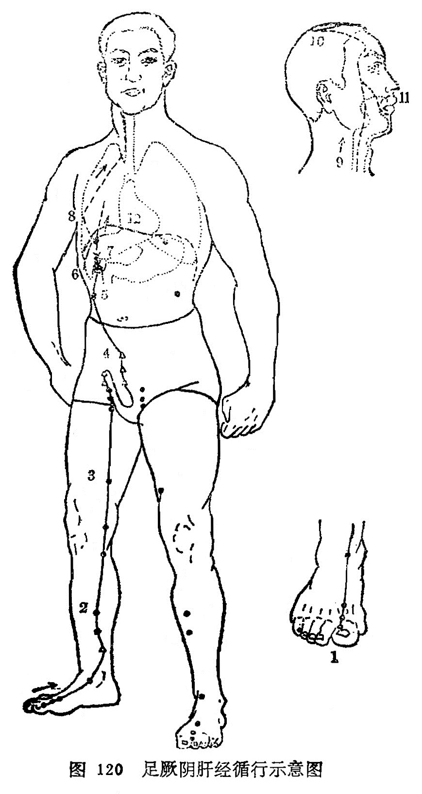

#### （一）分布络属

分布径路：受胆经之交，起于足大趾背上丛毛边际，向上沿足背到内踝前1寸处，在向上沿胫骨内缘，于内踝上8寸处交叉到足太阴后面。沿[膝关](https://www.gmzyjc.com/read/zjs/zjs3.1.9-12-0.0.4.3.7.md)节和大腿内侧，进入阴毛中，环绕阴器，到达小腹，挟胃两旁向上穿过膈肌，分布在胁肋部，沿喉咙的后边，向上进入咽峡，连接眼[球后](https://www.gmzyjc.com/read/zjs/zjs3.4-0.1.1.5.0.md)通入颅腔（目系），再出来向上到额部与督脉交会在头顶部。

它的支脉，从眼[球后](https://www.gmzyjc.com/read/zjs/zjs3.4-0.1.1.5.0.md)通入颅腔（目系）里出来，向下到面颊的里边，环绕在口唇的里边。

另条支脉，从肝分出，贯串膈肌，脉气向上注入肺（交给手太阴肺经）。

络属脏腑：属肝，络胆，联系胃、肺。

经过器官：生殖器，喉咙，颏颡（咽峡部），目系，颊里，唇内。

本经腧穴：

十二肝经足厥阴，前内侧线穴细分。

**[大敦](https://www.gmzyjc.com/read/zjs/zjs3.1.9-12-0.0.4.3.1.md)**𧿹**指外上取，**[行间](https://www.gmzyjc.com/read/zjs/zjs3.1.9-12-0.0.4.3.2.md)大次趾缝间。

**[太冲](https://www.gmzyjc.com/read/zjs/zjs3.1.9-12-0.0.4.3.3.md)**本节后寸半，踝前一寸**[中封](https://www.gmzyjc.com/read/zjs/zjs3.1.9-12-0.0.4.3.4.md)**停。

踝上五寸**[蠡沟](https://www.gmzyjc.com/read/zjs/zjs3.1.9-12-0.0.4.3.5.md)**是，**[中都](https://www.gmzyjc.com/read/zjs/zjs3.1.9-12-0.0.4.3.6.md)**踝上七寸循。

**[膝关](https://www.gmzyjc.com/read/zjs/zjs3.1.9-12-0.0.4.3.7.md)**[犊鼻](https://www.gmzyjc.com/read/zjs/zjs3.1.1-3-0.1.3.3.35.md)下二寸，**[曲泉](https://www.gmzyjc.com/read/zjs/zjs3.1.9-12-0.0.4.3.8.md)**曲膝尽横纹。

**[阴包](https://www.gmzyjc.com/read/zjs/zjs3.1.9-12-0.0.4.3.9.md)**膝上方四寸，**五里**股内动脉存。

**[阴廉](https://www.gmzyjc.com/read/zjs/zjs3.1.9-12-0.0.4.3.11.md)**恰在鼠溪下，**[急脉](https://www.gmzyjc.com/read/zjs/zjs3.1.9-12-0.0.4.3.12.md)**阴旁二五真。

十一肋端[章门](https://www.gmzyjc.com/read/zjs/zjs3.1.9-12-0.0.4.3.13.md)是，乳下二肋寻**[期门](https://www.gmzyjc.com/read/zjs/zjs3.1.9-12-0.0.4.3.14.md)**。

图120足厥阴肝经循行示意图

图解：肝足厥阴之脉，①起于大趾丛毛之际，上循足跗[上廉](https://www.gmzyjc.com/read/zjs/zjs3.1.1-3-0.1.2.3.9.md)，②去内踝一寸，上踝8寸，交出太阴之后③上胭内廉，循股阴。④入毛中，环阴器，抵小腹，⑤挟胃，⑥属肝，⑦絡胆，⑧上贯膈，布胁肋，循喉咙之后，⑨上入颃颡，连目系，⑩上出额，与督脉会于巅。其支者，⑪从目系下颊里，环唇内，其支者， ⑫复从肝别，贯膈，上注肺（《灵枢·经脉》）。
