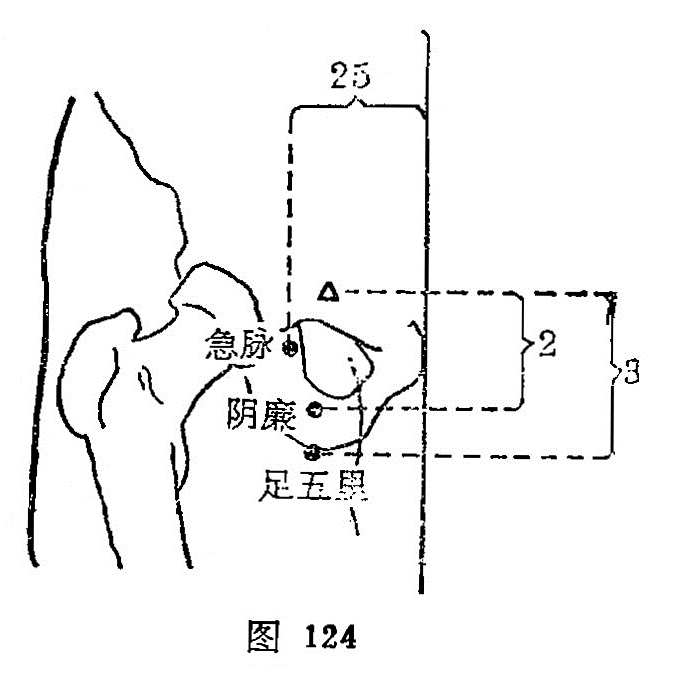

##### 阴廉

〔定位〕曲骨旁开2寸，气冲穴直下2寸，当内收长肌外缘（图124）。

〔解剖〕有内收长肌和内收短肌，有旋股内侧动、静脉的分支；布有股内侧皮神经分支，深层为闭孔神经的浅支和深支。

〔功能〕调经血，理下焦。

〔主治〕月经不调，带下，小腹痛，下肢挛急。

〔刺灸〕直刺0.8~1寸。可灸。

〔讲述〕见于《甲乙》。内侧为阴，边缘为廉，穴居股内侧外边，因名。《甲乙》：治妇人绝产，若未曾生产之不孕症。现今多治局部病痛。临床常配箕门治股内侧痛，配关元、归来、三阴交治月经不调。

