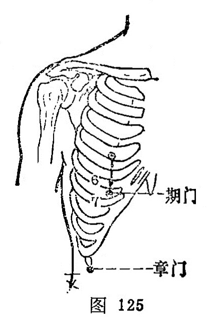

##### 期门

〔定位〕乳头直下，第6肋间隙（图125）。

〔解剖〕在第6、7肋间内端，有腹内外斜肌及腹横肌，有第6肋间动、静脉；布有第6肋间神经。

〔功能〕疏肝理脾，调气活血。

〔主治〕胸胁胀满疼痛，呕逆吞酸，胁下积聚，奔豚喘咳，疟疾。

〔刺灸〕斜刺0.5~0.8寸。可灸。

〔讲述〕见于《伤寒论》。别称肝募。期指一周，人体十二经气血始于云门，终于期门，周而复始，因名。穴属肝募，又为足太阴、厥阴、阴维之会，主治肝、胆、胁肋、胸膈、脾胃等疾患。临床用治胁痛，常配间使能疏肝理气，通络止痛，治情志失测，气阻胁络所致者；配三阴交能疏肝理气，活血散瘀，治肝郁血滞，阻滞胁络之疾；配丰隆、阴陵泉能化瘀祛浊，治痰饮流注，胁络阻滞之胁痛；配膻中、内关治胸满痛；配中腕、内关、足三里治呕吐；配大敦治坚痃疝气。临床根据《问对》“肝之募也，伤寒过经不解刺之，使其不再传也；妇人经脉不调，热入血室刺之，以其肝藏血也；胸满腹胀，胁下肥气，凡是木郁诸疾莫不剩之，以其肝主病也"，说明了期门的主要作用。查刺期门治伤寒病，《伤寒论》曾经提出五条，这五条包括：肝乘脾、肝乘肺、误汗、热入血室，以及配巨阙治少阴尸厥等症。肝乘牌曰纵，肝乘肺曰横，刺期门用泻法，意在泻肝之实。误汗伤律，热结谵语，泻期门意在清肝之热。热入血室，刺期门意在泻瘀通结，清除血室之瘀热。

期门、章门右侧有肝脏，左下方有脾，均不可向上直深刺，可根据病人肌肉厚薄，以押手缓慢刺入，达到“候气为先，得气为度”即可。

