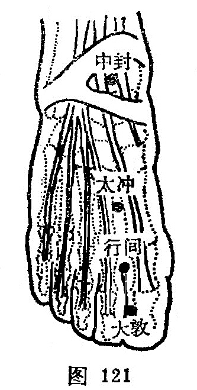

##### 中封

〔定位〕内踝前1寸，在商丘上方，胫骨前肌腱内缘跷足有陷处（图121）。

〔解剖〕在舟状骨结节上方，胫骨前肌腱内侧，有足背静脉网；布有足背内侧皮神经的分支及小腿内侧皮神经。

〔功能〕清肝胆，利下焦，舒筋脉。

〔主治〕疝气，阴痛，遗精，淋症，黄疸，胸腹胀满，内踝肿痛。

〔刺灸〕直刺0.5~0.8寸。可灸。

〔讲述〕出《灵枢·本输》。别称悬泉。关闭为封，穴在踝前陷中，是处有两大筋封闭，因名。《金鉴》：治梦泄遗精，阴缩，五淋，不得尿，鼓胀，瘿气。临床常配行间治振寒溲白尿难痛，配五里治身黄时有微热，配内庭治小腹胀满痛，配肝俞、胆俞治肝病，配阳辅治眩晕。配太冲、足三里治行步艰难，故有“行步艰难疾转加，太冲二穴效堪夸，更针三里中封穴，去病如同用手抓”之说。这是因为行步艰难，多系血凝气滞，形成屈伸不利之伤筋病，筋为肝主，肝藏血，血养筋脉，太冲、中封均系肝经俞穴，而太冲位于足背，中封位于踝前内侧，刺灸直接作用于局部，可疏通筋脉，加之三里为胃之合，具有清热、祛湿、消肿之力，三穴相配，其效更彰。

