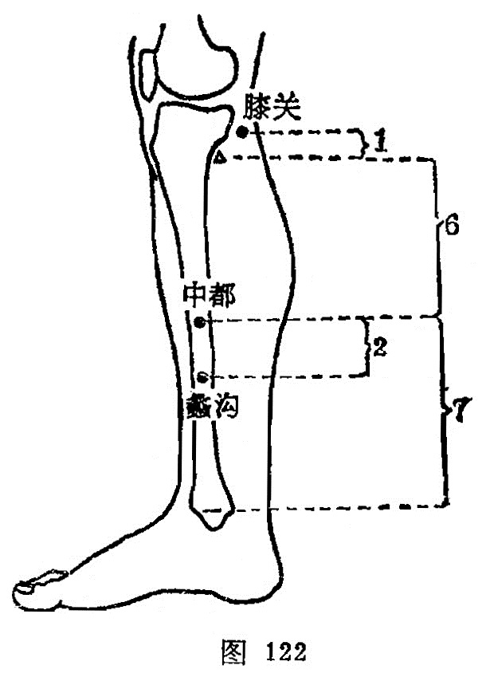

##### 中都

〔定位〕内踝上7寸，胫骨内侧面中央（图122）。

〔解剖〕在胫骨内侧面中部，有大隐静脉；布有隐神经的中支。

〔功能〕调肝理血。

〔主治〕胁痛，腹痛，泄泻，疝气，崩漏，恶露不尽。

〔刺灸〕平刺0.5~0.8寸。可灸。

〔讲述〕见于《甲乙》。别称中都。都有聚结之意，穴当小腿前内侧中间沟中，适当小腿的中部，因名。穴属本经之郄，具有止痛之力，故用治疝痛、痛经。《大成》：治肠澼，㿉疝，小腹痛不能行立，胫寒，妇人崩中，产后恶露不绝。临床常配关元、大敦、太冲治疝气；配三阴交、关元治痛经；配交信、地机治月经不调；配隐白治崩漏。

