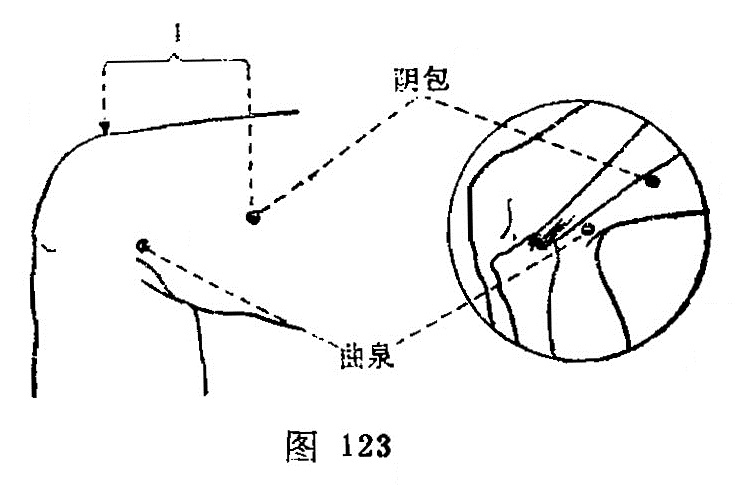

##### 阴包

〔定位〕股骨内上髁上4寸，缝匠肌后缘（图123）。

〔解剖〕在股内侧肌与缝匠肌之间，内收长肌中点，深层为内收短肌，有股动、静脉，旋股内侧动脉浅支；布有股前皮神经，闭孔神经浅、深支。

〔功能〕调经血，理下焦。

〔主治〕腰尻腹痛，遗溺，小便不利，月经不调。

〔刺灸〕直刺0.8~1寸。可灸。

〔讲述〕见于《甲乙》。别称阴胞。内侧为阴；包有藏的含意，又与胞、脬同意。因肝脉行脾、肾二经之中间，二经皆属阴，穴居股内廉两筋间，故名。《大成》：治腰尻引少腹痛，小便难，遗溺，妇人月经不调。临床常配中极、水道、阴陵泉治小便不利，配列缺治遗溺，配关元、三阴交治月经不调。

