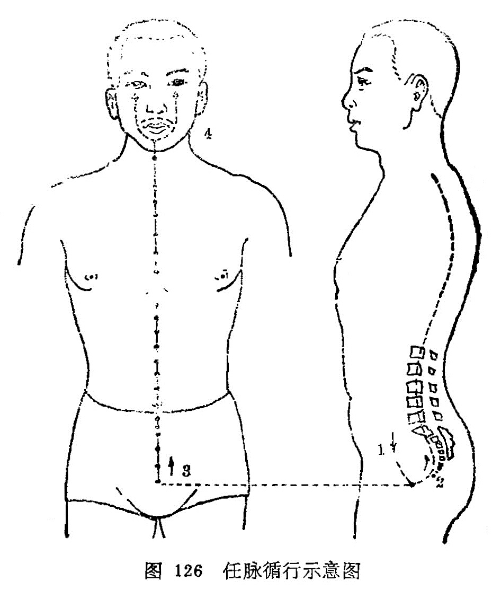

#### （一）分布联系

分布径路：从会阴部起始，沿腹和胸部的正中上行，至咽喉，和冲脉会合，再向上到颌部，环绕口唇，沿面颊到达眼下部中央。它的分支与冲脉同起于胞中，向后与督脉、足少阴之脉相并，贯串脊柱里面。

联络器官：胞，口唇，眼。

本经踰穴：

十三任脉走胸腹，直线上行居正中。

**会阴**两阴中间取，**曲骨**耻骨联合从。

**中极关元石门**穴，每穴相距一寸均。

**气海**脐下一寸半，脐下一寸阴交明。

肚脐中央名**神阙**、**水分下脘建里**匀。

**中脘上脘**皆一寸，**巨阙**脘上一寸连。

**鸠尾**蔽骨下五分，**中庭**膻下寸六凭。

**膻中**正在两乳间，**玉堂紫宫华盖**穴。

相距一肋**璇玑**存，胸骨上缘取**天突**。

颌下结上寻**廉泉**，**承浆**唇下宛宛中。

图解：任脉者，①起于中极之下，以上毛际，循腹里，上关元，至咽喉，②上循脊里，为经络之海，③其浮而外者，循腹（右）上行，会于咽喉，别而络唇口，④连上颐，循面，入目（《灵枢•骨空论》、《灵枢•五音五味》）。
