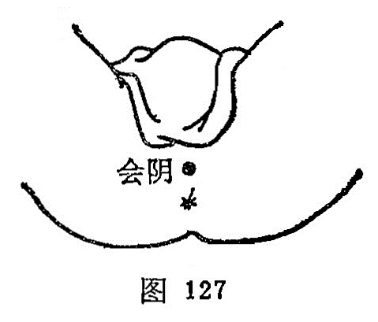

##### 会阴

〔定位〕截石位，在会阴部正中，男子当肛门与阴囊之间，女子当肛门与大阴唇后联合之间（图127）。

〔解剖〕在球海绵体中央，会阴浅、深横肌中，布有会阴动、静脉分支；布有会阴神经分支。

〔功能〕调经强肾，苏厥回阳，清利湿热。

〔主治〕二便不利，痔疮，月经不调，遗精，癫狂，惊痫，溺水窒息，阴痒、阴部汗湿，脱肛，阴挺。

〔刺灸〕直刺0.5〜1寸。可灸。

〔讲述〕见于《甲乙》。别称屏翳、金门、海底。聚结相合之处曰会，穴在两阴之间，为任、督、冲三脉的起点，三脉皆属阴，会聚阴部，因名。《大成》：治阴汗，阴头痛，阴冲诸病，前后相引痛，不得大小便，男子阴寒冲心，窍中热，皮肤痛，谷道搔痒，久痔相通，女子经水不通，卒死者。临床常配肾俞治遗精，配蠡沟治阴痒，配气海、归来治阴挺，配中极、三阴交治阴门红肿痛，配人中治溺死。刺时注意消毒，以防感染。
