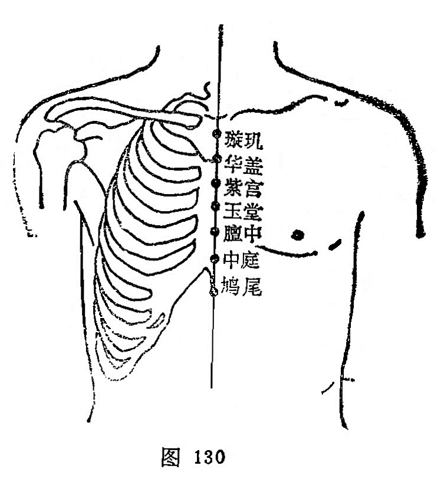

##### 紫宫

〔定位〕在胸骨正中线上，平第2肋间隙（图130）。

〔解剖〕在胸骨体上，布有胸廓（乳房）内动、静脉的前穿支；布有第2肋间神经前皮支的内侧支。

〔功能〕宽胸止咳，清肺利咽。

〔主治〕咳嗽，气喘，胸痛，喉痹，咽塞，吐血。

〔刺灸〕平刺0.3〜0.5寸。可灸。

〔讲述〕见于《甲乙》。紫为赤色，与绛同义；中央为宫。昔有心脏为“绛宫"，又紫为离九，离为心火，可见紫宫实指心主；因穴近心脏，加之任脉至此，正内合于心，心为血之主宰，因名。本穴除主咳嗽、胸痛外，还可用于心烦、卒痛之疾。《甲乙》：主胸胁支满，痹痛骨痛，饮食不下，呕逆，气上烦心。临床配天突、风门、肺俞治咳喘；配廉泉、天突治喉痹咽塞，配心俞、内关治心烦，卒痛。

