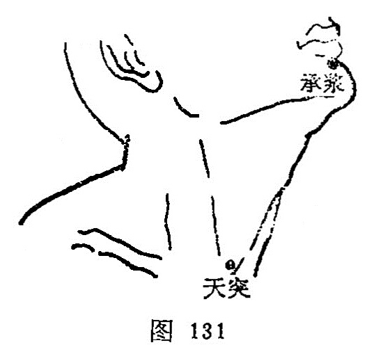

##### 天突

〔定位〕胸骨上窝正中（图131）。

〔解剖〕在左右胸锁乳突肌之间，深层左右为胸骨舌骨甲状肌，皮下有颈静脉弓，甲状腺下动脉分支，深层为气管，再向下，在胸骨柄后方为无名静脉及主动脉弓；布有锁骨上神经前支。

〔功能〕宽胸理气，通利气道，降痰宣肺。

〔主治〕气喘，咳嗽，暴瘖，咽喉肿痛，呕逆，瘿瘤，梅核气。

〔刺灸〕先直刺0.2寸，然后将针尖转向下方，紧靠胸骨后方刺入0.5〜1.0寸。可灸。

〔讲述〕出《灵枢•本输》。别称玉户、天瞿。天，指上突，指结喉突起，又指烟囱。因穴当结喉上，主治咽喉疾病，因名。由于咽喉连于肺胃，喉为呼吸之门，肺气不宣，气道不利，痰气，交阻所引起的咳、喘、气逆之疾外，因咽主通利水谷，为胃之系，故可用治食道疾患如痉挛、呃逆，吞咽困难。用治咳喘，能降痰浊，利气道，因寒所致配灸[中府](https://www.gmzyjc.com/read/zjs/zjs3.1.1-3-0.1.1.3.1.md)、[膻中](https://www.gmzyjc.com/read/zjs/zjs3.2.1-0.1.1.3.16.md)，因热配[内庭](https://www.gmzyjc.com/read/zjs/zjs3.1.1-3-0.1.3.3.44.md)、[尺泽](https://www.gmzyjc.com/read/zjs/zjs3.1.1-3-0.1.1.3.5.md)，咳甚配[列缺](https://www.gmzyjc.com/read/zjs/zjs3.1.1-3-0.1.1.3.7.md)，化火配[行间](https://www.gmzyjc.com/read/zjs/zjs3.1.9-12-0.0.4.3.2.md)。但虚喘，肾不纳气，不宣刺本穴，泻之伤气。用治脏躁、梅核气可配[廉泉](https://www.gmzyjc.com/read/zjs/zjs3.2.1-0.1.1.3.21.md)散瘀，[太冲](https://www.gmzyjc.com/read/zjs/zjs3.1.9-12-0.0.4.3.3.md)疏肝，[膻中](https://www.gmzyjc.com/read/zjs/zjs3.2.1-0.1.1.3.16.md)顺气；兼纳呆脘闷加[中脘](https://www.gmzyjc.com/read/zjs/zjs3.2.1-0.1.1.3.11.md)、[公孙](https://www.gmzyjc.com/read/zjs/zjs3.1.4-6-0.0.1.3.4.md)。配[少商](https://www.gmzyjc.com/read/zjs/zjs3.1.1-3-0.1.1.3.10.1.md)治咽肿痛；配[通里](https://www.gmzyjc.com/read/zjs/zjs3.1.4-6-0.0.2.3.5.md)治暴瘖不能言；配[内关](https://www.gmzyjc.com/read/zjs/zjs3.1.9-12-0.0.1.3.6.md)、[中脘](https://www.gmzyjc.com/read/zjs/zjs3.2.1-0.1.1.3.11.md)能利膈和中，解除食道之梗阻；配[气舍](https://www.gmzyjc.com/read/zjs/zjs3.1.1-3-0.1.3.3.11.md)可消瘿散结。

刺本穴应先直刺0.2寸，然后将针尖转向下方，紧靠胸骨后方刺入，针在胸骨柄后缘和气管前缘，不可向后下方深剌，更禁向左右两侧深刺，针刺不宜过深，不宜捻转过多，因深刺易伤及主动脉和无名动脉，左右偏刺易伤及肺尖或锁骨下动脉。《铜人图经》说：针宜直下，不得低手，低手伤五脏气，令人寿短。治疗瘿瘤，特别是血瘿，忌用粗针深刺，以防出血。