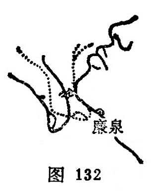

##### 廉泉

〔定位〕结喉上方，当舌骨的下缘凹陷处取之；或医者以拇指关节横纹对准下颏，当拇指尖到达处是穴（图132）。

〔解剖〕在甲状软骨和舌骨之间，深部为会厌，下方为喉门，有甲状舌骨肌、舌肌，有颈前浅静脉，甲状腺上动、静脉；布有颈皮神经，深层有舌下神经分支。

〔功能〕通调舌络，清利咽喉。

〔主治〕舌下肿痛，舌缓流涎，中风舌强不语，暴喑，乳蛾，咽食困难，舌肌萎缩。

〔刺灸〕向舌根斜刺0.5~0.8寸。可灸。

〔讲述〕出《灵枢•热病》。别称本池、舌本。舌为廉、廉又指棱角状；液为泉。因穴上部有结喉，形似棱角，内当舌下，主治舌咽疾患，因名。穴属任脉、阴维之会。心气通于舌，舌为心之苗，故凡温邪上攻，损伤舌络，心脾积热，熏壅舌本，心火上炎，上扰舌络所致之舌疮、重舌、木舌、弄舌以及舌强、舌喑可审因配本穴通调舌络，消散壅滞。如心火上炎配通里；心脾蕴热配三阴交，点刺金津、玉液出血；痰盛加丰隆，胃热加内庭，肺热加尺泽，阴虚咽痛加太溪、复溜，暴瘖初发有外感者加尺泽、外关，点剌少商出血。因寒客于会厌配肺俞、天突、列缺、风门；久瘖加尺泽、复溜、少商清热养阴，润肺益音。舌肌麻痹加补通里，心脾不足加神门、三阴交，气血亏少加三阴交、合谷，肾经亏损加肾俞、太溪、复溜，肝气郁结加间使、太冲，喑哑失语配哑门。