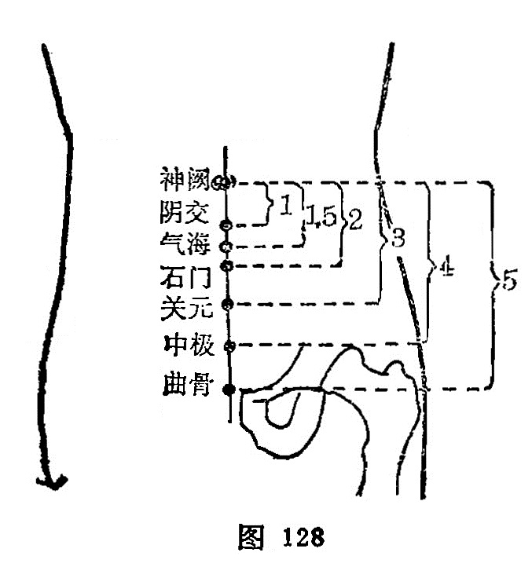

##### 神阙

〔定位〕脐窝正中（图128）。

〔解剖〕在脐窝正中，深层为小肠，有腹壁下动、静脉；布有第10肋间神经前皮支的内侧支。

〔功能〕培元固本，回阳救脱，和胃理肠。

〔主治〕腹痛肠鸣，水肿臌胀，泡利脱肛，中风脱症，小便不禁。

〔刺灸〕禁针，隔盐灸5〜15壮，严禁起泡，以防感染。

〔讲述〕见于《外台》。别称脐中、气舍、，气合。变化莫测龙神，阙指要处，穴当脐孔，是处胎生之时，连系脐带，以供胎之营养，故又名命蒂；名之神阙，乃因胎儿赖此宫阙输送营养，灌注全身，随使胎体遂渐发育，变化莫测，因名。本穴除治中风脱症、厥逆之疾外，还可用治腹泻、绞痛、脱肛等症。一般不针，可纳炒盐，外敷姜片灸之。根据阴难急复，阳当速回的原则，灸神阙，配人中、百会、关元、合谷、足三里治脱症。配水分、阴陵泉治肠鸣水泄，配长强、气海治脱肛；配关元、脾俞，治脾阳不振，阴寒内积之腹痛；配大敦温肝散寒，治厥阴失疏之少腹拘急冷痛。用治霍乱吐泻，可灸神阙，补关元、合谷温阳益气，以防虚脱；凡脘闷痞塞加天枢，中脘振奋中阳。用治泄泻，常配天枢、水分、足三里、上巨虚。本穴因不易消毒，易发感染，故禁针，灸亦应防止感染。

