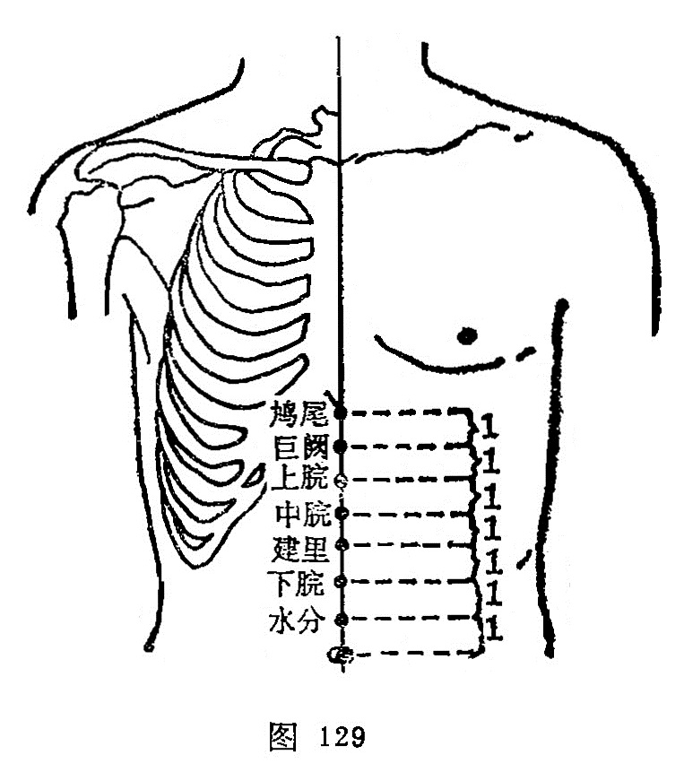

##### 下脘

〔定位〕在前正中线上，脐上2寸（图129）。

〔解剖〕在腹白线上，深部为横结肠，有腹壁上、下动、静脉交界处的分支；布有第8肋间神经前皮支的内侧支。

〔功能〕和中理气，温中化湿。

〔主治〕腹痛肠鸣，饮食不化，呕吐反胃，脾胃虚弱。

〔刺灸〕直刺1〜2寸。可灸。

〔讲述〕见于《甲乙》。别称下着、[幽门](https://www.gmzyjc.com/read/zjs/zjs3.1.7-8-0.0.2.3.21.md)。下与上相对，脘同管，穴在脐上2寸，适当胃的下口处，因名。穴属脾会，故除主胃腑疾病外，偏重治疗小肠、脾不运化之疾。从《甲乙》、《千金》、《外台》、《铜人》等书所载[下脘](https://www.gmzyjc.com/read/zjs/zjs3.2.1-0.1.1.3.9.md)的主治为"食饮不化，入腹还出”及“六腑气寒，谷不转化”等来看，说明本穴有健脾利湿，促进小脉吸收，兼能散祛肠腑瘀滞之效。本穴所以有此功能，是因脾恶湿，脾喜升，六腑气寒，脾不运化，必然影响小肠泌别清浊的功能而致泄利腹内肠鸣；若运化失常，气阻不畅必生食滞闭阻之疾，钋灸[下脘](https://www.gmzyjc.com/read/zjs/zjs3.2.1-0.1.1.3.9.md)可达温中化湿，消积化滞之效。临床常配足兰里治饮食不化，配[足三里](https://www.gmzyjc.com/read/zjs/zjs3.1.1-3-0.1.3.3.36.md)、膈[中脘](https://www.gmzyjc.com/read/zjs/zjs3.2.1-0.1.1.3.11.md)、[脾俞](https://www.gmzyjc.com/read/zjs/zjs3.1.7-8-0.0.1.3.20.md)治翻胃，配[中脘](https://www.gmzyjc.com/read/zjs/zjs3.2.1-0.1.1.3.11.md)、[足三里](https://www.gmzyjc.com/read/zjs/zjs3.1.1-3-0.1.3.3.36.md)、[胃俞](https://www.gmzyjc.com/read/zjs/zjs3.1.7-8-0.0.1.3.21.md)、[四缝](https://www.gmzyjc.com/read/zjs/zjs3.4-0.1.4.2.0.md)治消化不良，配[内关](https://www.gmzyjc.com/read/zjs/zjs3.1.9-12-0.0.1.3.6.md)、[中脘](https://www.gmzyjc.com/read/zjs/zjs3.2.1-0.1.1.3.11.md)治呕吐，配[天枢](https://www.gmzyjc.com/read/zjs/zjs3.1.1-3-0.1.3.3.25.md)、[陷谷](https://www.gmzyjc.com/read/zjs/zjs3.1.1-3-0.1.3.3.43.md)治肠鸣腹胀，配[天枢](https://www.gmzyjc.com/read/zjs/zjs3.1.1-3-0.1.3.3.25.md)、[上巨虚](https://www.gmzyjc.com/read/zjs/zjs3.1.1-3-0.1.3.3.37.md)通腑气治便秘，配[公孙](https://www.gmzyjc.com/read/zjs/zjs3.1.4-6-0.0.1.3.4.md)消食导滞，配[大横](https://www.gmzyjc.com/read/zjs/zjs3.1.4-6-0.0.1.3.15.md)、[四缝](https://www.gmzyjc.com/read/zjs/zjs3.4-0.1.4.2.0.md)通肠驱蛔。

