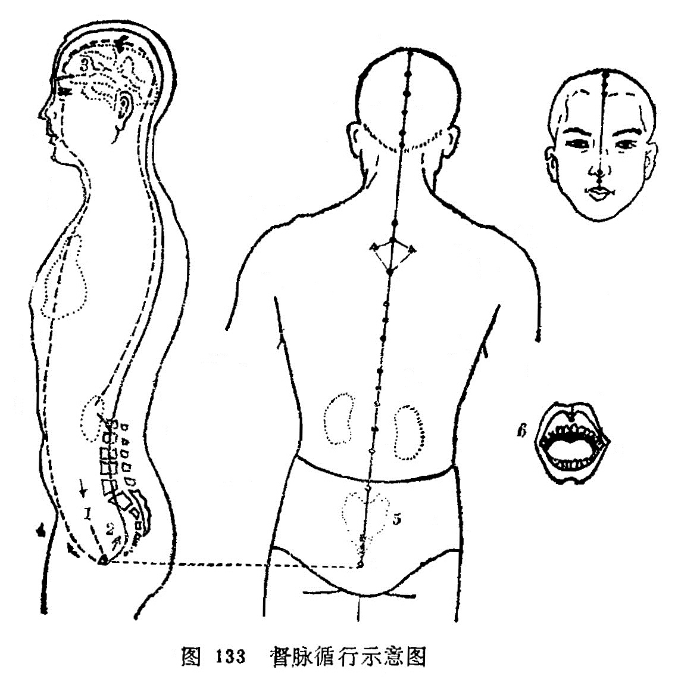

#### （一）分布联系

分布径路：从[会阴](https://www.gmzyjc.com/read/zjs/zjs3.2.1-0.1.1.3.1.md)起始，沿脊柱里面上行，直到顶后[风府](https://www.gmzyjc.com/read/zjs/zjs3.2.2-0.0.1.3.16.md)穴，进入颅内，联系于脑，再回出来上行到头顶，沿着前额正中到达鼻柱下方。它的第一条分支，与冲脉、任脉同起于胞中，出来到[会阴](https://www.gmzyjc.com/read/zjs/zjs3.2.1-0.1.1.3.1.md)部，在尾骨端与足少阴从大腿内侧来的主干以及和足太阳的脉气会合，一起贯串脊柱里面，出来归属于肾脏；第二支脉，从小腹内部直上贯串肚脐，向上连贯心脏，到咽喉与任脉、冲脉会合，向上到下颌部，环绕口唇，联系两眼下部的中央。它的第三条支脉，与足太阳同起于内眼角，并上行到前额，在头顶左右相交，进入联络于脑，再回出来，沿着肩胛骨内，脊柱两旁，到达腰部，进入脊柱两旁的肌肉，联络肾脏。

联系器官：胞，肾，脊髓，脑，眼，鼻，口唇。

本经腧穴：

十四督脉行脊梁，尾闾骨端是**[长强](https://www.gmzyjc.com/read/zjs/zjs3.2.2-0.0.1.3.1.md)**。

二十一椎为**[腰俞](https://www.gmzyjc.com/read/zjs/zjs3.2.2-0.0.1.3.2.md)**，十六**阳关**细推详。

**命门**十四三**[悬枢](https://www.gmzyjc.com/read/zjs/zjs3.2.2-0.0.1.3.5.md)**，十一椎下**[脊中](https://www.gmzyjc.com/read/zjs/zjs3.2.2-0.0.1.3.6.md)**藏。

**[中枢](https://www.gmzyjc.com/read/zjs/zjs3.2.2-0.0.1.3.7.md)**十椎九**[筋缩](https://www.gmzyjc.com/read/zjs/zjs3.2.2-0.0.1.3.8.md)**，七椎之下乃**[至阳](https://www.gmzyjc.com/read/zjs/zjs3.2.2-0.0.1.3.9.md)**。

六**灵**五**神**三**[身柱](https://www.gmzyjc.com/read/zjs/zjs3.2.2-0.0.1.3.12.md)**，**[陶道](https://www.gmzyjc.com/read/zjs/zjs3.2.2-0.0.1.3.13.md)**一椎之下襄。

**[大椎](https://www.gmzyjc.com/read/zjs/zjs3.2.2-0.0.1.3.14.md)**正在一椎上，诸阳会此仔细详。

**[哑门](https://www.gmzyjc.com/read/zjs/zjs3.2.2-0.0.1.3.15.md)**入发五分是，**[风府](https://www.gmzyjc.com/read/zjs/zjs3.2.2-0.0.1.3.16.md)**一寸宛中当。

府上寸半寻**[脑户](https://www.gmzyjc.com/read/zjs/zjs3.2.2-0.0.1.3.17.md)**，**[强间](https://www.gmzyjc.com/read/zjs/zjs3.2.2-0.0.1.3.18.md)**户上寸半量。

**[后顶](https://www.gmzyjc.com/read/zjs/zjs3.2.2-0.0.1.3.19.md)**再上一寸半，**[百会](https://www.gmzyjc.com/read/zjs/zjs3.2.2-0.0.1.3.20.md)**七寸顶中央。

**[前顶](https://www.gmzyjc.com/read/zjs/zjs3.2.2-0.0.1.3.21.md)**[囟会](https://www.gmzyjc.com/read/zjs/zjs3.2.2-0.0.1.3.22.md)俱寸五，**[上星](https://www.gmzyjc.com/read/zjs/zjs3.2.2-0.0.1.3.23.md)**入发一寸量。

**[神庭](https://www.gmzyjc.com/read/zjs/zjs3.2.2-0.0.1.3.24.md)**五分入发际，**[素髎](https://www.gmzyjc.com/read/zjs/zjs3.2.2-0.0.1.3.25.md)**鼻尖准头乡。

**[人中](https://www.gmzyjc.com/read/zjs/zjs3.2.2-0.0.1.3.26.md)**鼻下上唇陷，**[兑端](https://www.gmzyjc.com/read/zjs/zjs3.2.2-0.0.1.3.27.md)**唇上尖端藏。

**[龈交](https://www.gmzyjc.com/read/zjs/zjs3.2.2-0.0.1.3.28.md)**上齿龈缝里，经行背头居中行。

图解：督脉者，①起于少腹以下骨中央，其络循阴器，合篡（[会阴](https://www.gmzyjc.com/read/zjs/zjs3.2.1-0.1.1.3.1.md)部）后，别绕臀至少阴，与巨阳（足太阳）中结者合。②少阴上股内后廉，贯脊属肾，③与太阳起于目内眦，上额，交巅上，入络脑，还出别下项，循肩膊内，侠脊抵腰中，入循膂，络肾……，④其少腹直上者，贯脐中央，上贯心，入喉，上颈，环唇，上系两目之下中央。⑤起于下极之俞，并于脊里，上至[风府](https://www.gmzyjc.com/read/zjs/zjs3.2.2-0.0.1.3.16.md)，入于脑，⑥上巅，循额，至鼻柱（《素问·骨空论》)、（《难经》）。
