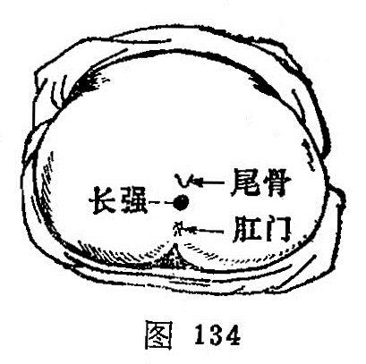

##### 长强

〔定位〕在尾骨尖端下方的凹陷中（图134）。

〔解剖〕在肛尾膈中，有肛门动、静脉分支，棘间静脉丛之延续部；布有尾神经及肛门神经。

〔功能〕通任督，调肠腑，利湿热。

〔主治〕泄泻，便血，痔疮，脱肛，便秘，腰脊痛，尾骶部疼痛，痫症。

〔刺灸〕紧靠尾骨前面斜刺0.5～1寸，不得刺穿直肠，防止感染。可灸。

〔讲述〕出《灵枢·经脉》。别称气之[阴郄](https://www.gmzyjc.com/read/zjs/zjs3.1.4-6-0.0.2.3.6.md)、龟尾、尾闾、上天梯。循环无端谓长，健运不息为强，人体脊柱从颈到尾端，能自由转动弯曲，为荷重之主力，加之督脉之络，[夹脊](https://www.gmzyjc.com/read/zjs/zjs3.4-0.1.2.4.0.md)，上项，散头上，其分布路线长而作用强，穴居尾闾，联接任脉，循环不止，因名。穴属督络，为足少阴、少阳所结之会。除主脊强，头重高摇以及痫狂外，主要用治肛肠疾患。《大成》：主治肠风下血，久痔痿，腰脊痛，狂病，大小便难，头重，洞泄，五淋。临床常配[承山](https://www.gmzyjc.com/read/zjs/zjs3.1.7-8-0.0.1.3.57.md)治大小便难，配[小肠俞](https://www.gmzyjc.com/read/zjs/zjs3.1.7-8-0.0.1.3.27.md)治淋癃，配[大敦](https://www.gmzyjc.com/read/zjs/zjs3.1.9-12-0.0.4.3.1.md)治小肠气痛，配[百会](https://www.gmzyjc.com/read/zjs/zjs3.2.2-0.0.1.3.20.md)、[大肠俞](https://www.gmzyjc.com/read/zjs/zjs3.1.7-8-0.0.1.3.25.md)治脱肛，配[后溪](https://www.gmzyjc.com/read/zjs/zjs3.1.4-6-0.0.3.3.3.md)、[大椎](https://www.gmzyjc.com/read/zjs/zjs3.2.2-0.0.1.3.14.md)、[腰奇](https://www.gmzyjc.com/read/zjs/zjs3.4-0.1.2.8.0.md)、[长强](https://www.gmzyjc.com/read/zjs/zjs3.2.2-0.0.1.3.1.md)刺血治痫症。
