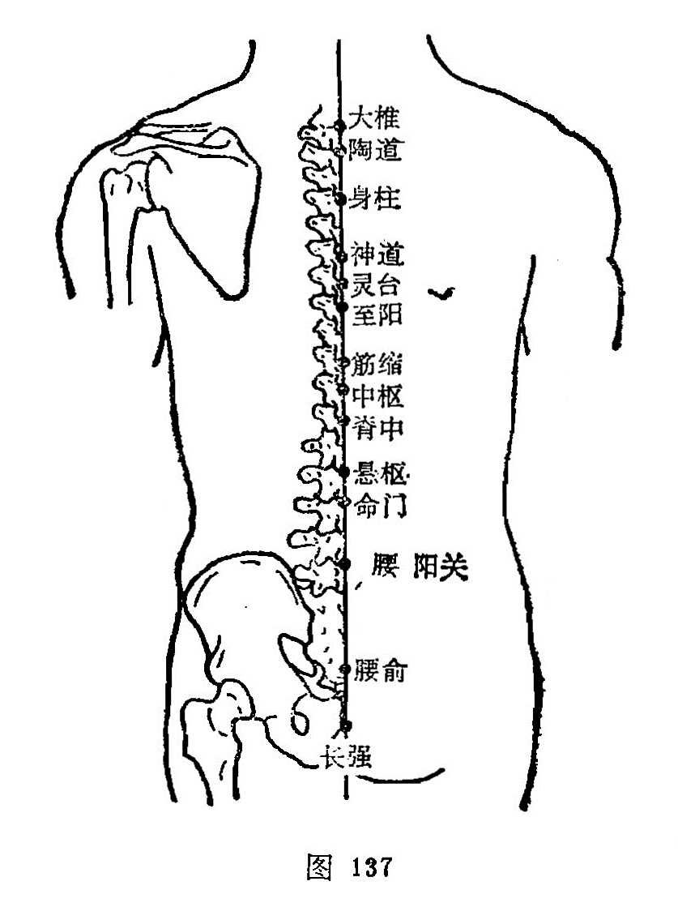

##### 陶道

〔定位〕在第1胸椎棘突下（图137）。

〔解剖〕在腰背筋膜，棘上韧带及棘间韧带中，有第1肋间动脉后支，棘间皮下静脉丛；布有第1胸神经后支的内侧支。

〔功能〕解表退热，镇惊安神。

〔主治〕脊强，头痛，疟疾，热病，癫狂，角弓反张。

〔刺灸〕向上斜刺0.5～1寸。可灸。

〔讲述〕见于《甲乙》。陶指陶灶，又有乐的含意，本穴通行阳气，有如陶灶的通路；又主治郁闷不畅，恍惚不乐，因名。《甲乙》：主头重目瞑，凄厥，寒热汗不出。《大成》：治痎疟寒热，洒渐脊强，烦满，汗不出，头重，目瞑，瘈疭，恍惚不乐。《图翼》：退骨蒸之热。临床常配心俞、神门治恍惚不乐，神志不安。配肺俞治发热，配后溪、身柱、风门治头项、脊背疼痛，配大椎、间使、曲池治疟疾，配大椎、阴郄治阴虚发热。

