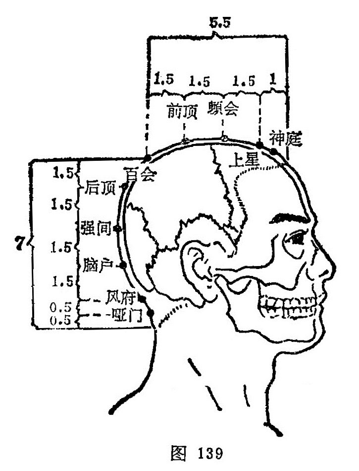

##### 风府

〔定位〕后发际正中直上1寸，两斜方肌之间的凹陷中（图139）。

〔解剖〕在项韧带，项肌中，深部为环枕后膜和小脑延髓池，有枕动、静脉分支及棘间静脉丛；布有第3颈神经及枕大神经支。

〔功能〕清热散风，通关开窍。

〔主治〕头痛，项强，眩晕，鼻衄，咽喉肿痛，中风不语，半身不遂，癫狂。

〔刺灸〕伏案正坐，使头微向前倾，项肌放松，向下颌方向缓慢刺入0.5～1寸。

〔讲述〕出《灵枢·本输》。别称舌本、惺惺、鬼枕。风指病邪，府有聚合之意。风为阳邪，其性轻扬，头顶之上惟风可到，本穴在项后发际，大筋间宛宛中，为足太阳、阳维、督脉之会，主治一切风邪为患，因名。《甲乙》：主头痛项急，不得倾倒，目眩，鼻不得喘息，舌急难言。狂易，多言不休，及狂走，欲自杀，及目妄见。暴喑不能言，喉嗌痛。说明本穴对头痛，失音，舌急难言，中风失音，以及癫痫有效。临床常配[百会](https://www.gmzyjc.com/read/zjs/zjs3.2.2-0.0.1.3.20.md)、[太冲](https://www.gmzyjc.com/read/zjs/zjs3.1.9-12-0.0.4.3.3.md)治头痛；配[哑门](https://www.gmzyjc.com/read/zjs/zjs3.2.2-0.0.1.3.15.md)治中风舌缓，暴音不语；配[承浆](https://www.gmzyjc.com/read/zjs/zjs3.2.1-0.1.1.3.22.md)治头项强痛，前后不能俯仰：配[人中](https://www.gmzyjc.com/read/zjs/zjs3.2.2-0.0.1.3.26.md)、[太冲](https://www.gmzyjc.com/read/zjs/zjs3.1.9-12-0.0.4.3.3.md)治惊风，配[本神](https://www.gmzyjc.com/read/zjs/zjs3.1.9-12-0.0.3.3.13.md)、[身柱](https://www.gmzyjc.com/read/zjs/zjs3.2.2-0.0.1.3.12.md)治痫症；配[神门](https://www.gmzyjc.com/read/zjs/zjs3.1.4-6-0.0.2.3.7.md)、[上脘](https://www.gmzyjc.com/read/zjs/zjs3.2.1-0.1.1.3.12.md)治癫狂。穴近[哑门](https://www.gmzyjc.com/read/zjs/zjs3.2.2-0.0.1.3.15.md)，下有生命[中枢](https://www.gmzyjc.com/read/zjs/zjs3.2.2-0.0.1.3.7.md)，《甲乙》说：刺入4分，留3呼。现在一般认为不超过1寸为宜。刺时针须向下方斜刺，不可向上深刺，免伤延髓。

