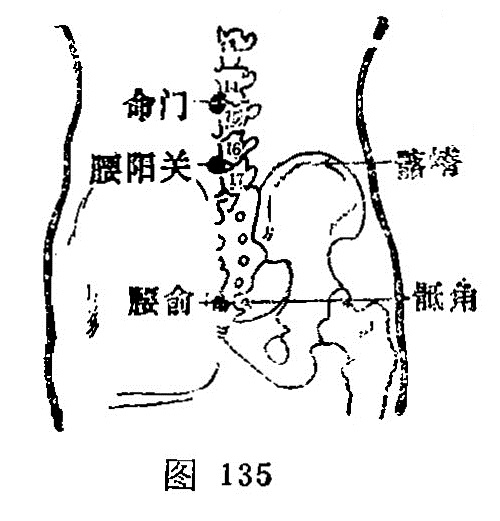

##### 腰俞

〔定位〕当骶管裂孔处（图135）。

〔解剖〕在骶后韧带，腰背筋膜中，有骶中动、静脉后支，棘间静脉丛；布有尾神经分支。

〔功能〕培补下焦，清热利湿。

〔主治〕月经不调，腰脊强痛，痔疾，痫症，下肢痿痹。

〔刺灸〕向上斜刺0.5～1寸。可灸。

〔讲述〕出《素问·缪刺论》。别称背解、腰户、腰柱。腰指腰部，俞指脉气转输之处，穴当[腰眼](https://www.gmzyjc.com/read/zjs/zjs3.4-0.1.2.6.0.md)处，《素问·缪刺论》：腰尻之解，是[腰俞](https://www.gmzyjc.com/read/zjs/zjs3.2.2-0.0.1.3.2.md)。腰尻指骶骨，解指骶管裂孔，本穴主治腰骶疾患，因名。《甲乙》：主治腰以下至足，清不仁。不可以坐起，尻不举，乳子下赤白。临床常配[委中](https://www.gmzyjc.com/read/zjs/zjs3.1.7-8-0.0.1.3.40.md)治腰背强痛，配[环跳](https://www.gmzyjc.com/read/zjs/zjs3.1.9-12-0.0.3.3.30.md)治冷风冷痹，配[百会](https://www.gmzyjc.com/read/zjs/zjs3.2.2-0.0.1.3.20.md)、[大肠俞](https://www.gmzyjc.com/read/zjs/zjs3.1.7-8-0.0.1.3.25.md)、[承山](https://www.gmzyjc.com/read/zjs/zjs3.1.7-8-0.0.1.3.57.md)治脱肛。

