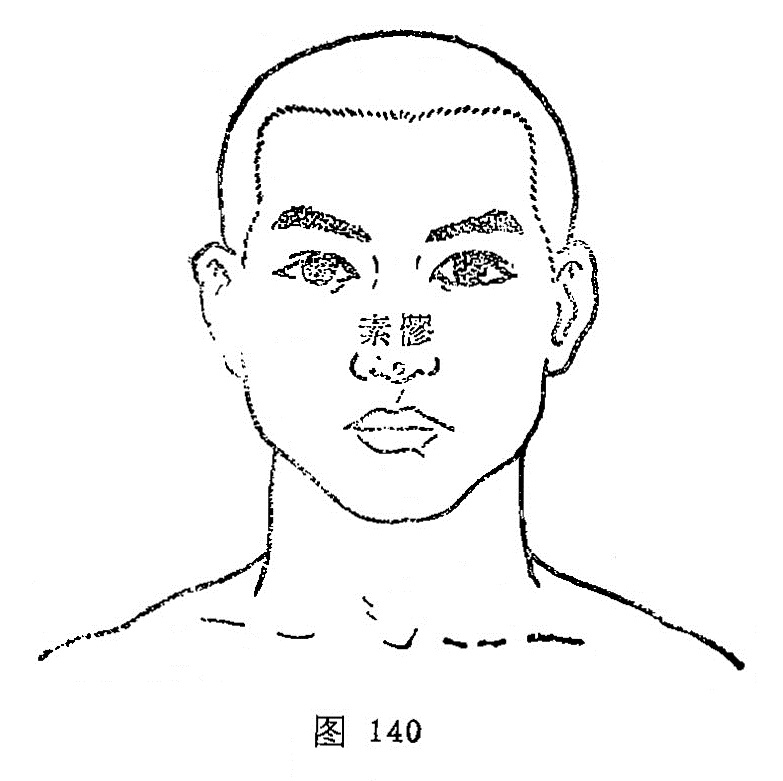

##### 素髎

〔定位〕在鼻尖正中（图140）。

〔解剖〕在鼻尖软骨中，有面动、静脉鼻背支；布有筛前神经鼻外支。

〔功能〕清热开窍。

〔主治〕昏厥，鼻塞，鼻衄，酒皶鼻，新生儿窒息。

〔刺灸〕向上斜刺0.3～0.5寸，或点刺出血，不灸。

〔讲述〕见于《甲乙》。别称面王、面正、鼻准、准头。洁白为素；髎指骨孔，又泛指穴位。肺开窍于鼻，肺应白色，穴当鼻尖，因名，本穴除用治鼻病外，还有苏厥之效。《甲乙》：主治鼽衄，涕出，中有悬痈，宿肉，窒洞不通，不知香臭。临床常配[迎香](https://www.gmzyjc.com/read/zjs/zjs3.1.1-3-0.1.2.3.20.md)、[合谷](https://www.gmzyjc.com/read/zjs/zjs3.1.1-3-0.1.2.3.4.md)治鼻衄，鼻疮，嗅觉失灵；配[十宣](https://www.gmzyjc.com/read/zjs/zjs3.4-0.1.4.1.0.md)、[涌泉](https://www.gmzyjc.com/read/zjs/zjs3.1.7-8-0.0.2.3.1.md)治昏厥；配[内关](https://www.gmzyjc.com/read/zjs/zjs3.1.9-12-0.0.1.3.6.md)、[百会](https://www.gmzyjc.com/read/zjs/zjs3.2.2-0.0.1.3.20.md)治低血压。刺[素髎](https://www.gmzyjc.com/read/zjs/zjs3.2.2-0.0.1.3.25.md)能增强呼吸功能及升血压。
