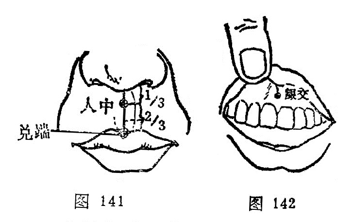

##### 兑端

〔定位〕上唇尖端，当人中沟下端与口唇连接处（图141）。

〔解剖〕在口轮匝肌中，有上唇动、静脉；布有面神经颊支及眶下神经分支。

〔功能〕清热，定惊，止痛。

〔主治〕癫狂，口㖞唇动，齿龈肿痛，鼻中癔肉，遗尿尿闭。

〔刺灸〕向上斜刺0.2～0.5寸，或点刺出血。禁灸。

〔讲述〕见于《甲乙》。兑指口，与锐意通；端有尖的含意。穴当上唇尖端，因名。除主局部口㖞唇动外，还可用于小便赤涩，舌干消渴，以及癫疾吐沫。临床常配本神治癫疾吐沫；配小海治小便赤涩；配目窗、正营、耳门治唇吻强，上齿龋痛。

