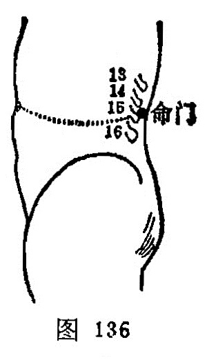

##### 命门

〔定位〕第2腰椎棘突下（图136、137）。

〔解剖〕在腰背筋膜，棘上韧带及棘间韧带中，有腰动脉后支及棘间皮下静脉丛；布有腰神经后支内侧支。

〔功能〕培元固本，强健腰膝。

〔主治〕脊强，腰痛，痛经，带下，阳萎，遗精，遗尿，泄泻，痢疾，神经衰弱，水肿。

〔刺灸〕直刺0.5～1寸。可灸。

〔讲述〕见于《甲乙》。别称属累、精宫、竹杖。穴当两肾俞的中间，横通少阴之气，为肾气之行所，是人体生命重要的门户，因名。由于命门乃“生命之根”、“主命之门”，是生气之源，精神之所舍，元气之所系，男子以藏精，女子以系胞，为脏腑之本，十二经之根，三焦气化之源，其真气通于肾，故凡胞宫、阴器、腰骶之疾均可取之。命门火衰则阳痿不举，可配肾俞、太溪补肾培元：少腹空虚，拘急凉痛，可配气海益气培元。命门火衰致使膀胱气化无权所致癃闭，可配补太溪、肾俞温肾阳，化气行水。命门火衰所致膀胱失约之遗尿，可配中极、气海、太溪，尿频可配肾俞加灸，补气海补益肾气，束约水液。若命门火衰，膀胱气化失常，水液停蓄，泛滥横溢所致水肿，可配肾俞、太溪、中极、水分温肾利水。如因命火式微，火不生土所致泄泻，可配肾俞、太溪温阳益脾，加脾俞、关元壮火逐冷以止泻。女子以系胞，火衰胞宫失养，则发病带下、不孕之疾，常配肾俞、太溪温肾培元，固本止带；配归来、三阴交、维胞治阴挺；配太溪、三阴交温宫补虚，加关元、石门逐寒湿，益胞宫，血旺宫暖，易受精而成胎。在男子以藏精，若真阳不足，精血虚少，乃致精液稀薄，可配三阴交、太溪、肾俞补真阳，益精血，则阳气充沛，精血旺盛。“腰者，肾之府，转摇不能，肾将惫矣”之腰痛，可配肾俞壮腰，三阴交益肾以止腰痛；凡见少腹拘急，小便不利可加复溜；凡扭伤筋脉，气滞血瘀可加龈交刺血；劳损不足可配气海俞益虚损；寒湿盛加灸肾俞、阴陵泉以散湿逐寒。刺本穴，不宜用粗针深刺，凡阴虚火旺和血虚发烧者不宜常灸，常灸可助火上炎。

