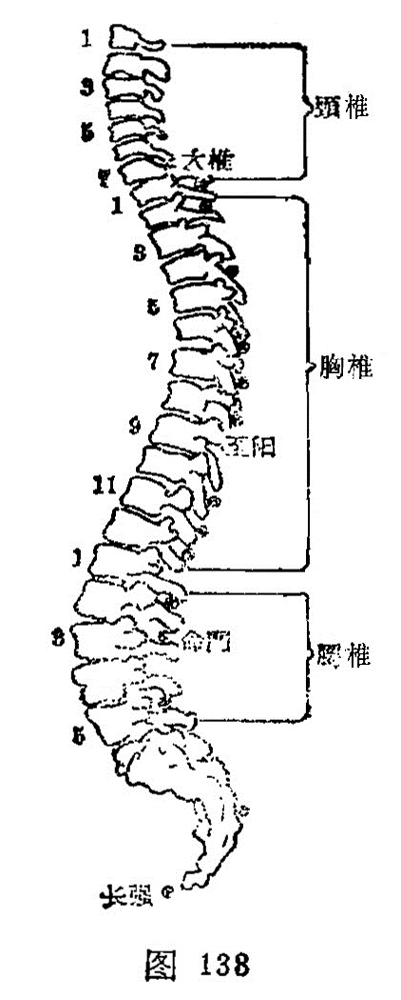

##### 至阳

〔定位〕在第7胸椎棘突下（图137、138）。

〔解剖〕在腰背筋膜，棘上韧带与棘间韧带中，有第7肋间动脉后支，棘间皮下静脉丛；布有第7胸神经后支内侧支。

腹中积上下行。《大成》：治腰脊强不得屈伸，积气上下行。

〔功能〕健脾调中，化湿祛黄。

〔主治〕胸脊痛，脊强，黄疸，胁肋疼痛，四肢重痛。

〔刺灸〕向上斜刺0.5～1寸。可灸。

〔讲述〕见于《甲乙》。别称肺底。至有极的含意，穴属督脉，位于背部，适当7椎之下，督为阳经，背亦属阳，七为阳数，因名。《素问·刺热篇》：主肾热。《甲乙》用治寒热懈懒。《金鉴》用治身面俱黄，胸胁支满，喘促不宁。临床常配阳陵泉、日月治胁肋痛，配胆俞、筋缩、阳陵泉治胆道蛔虫症；配肝俞、胆俞、阳陵泉、腕骨治黄疸。本穴所以能祛黄，是因此穴有健脾之力，脾健湿化则黄可退，所以有“黄疸至阳便能离”之说。

