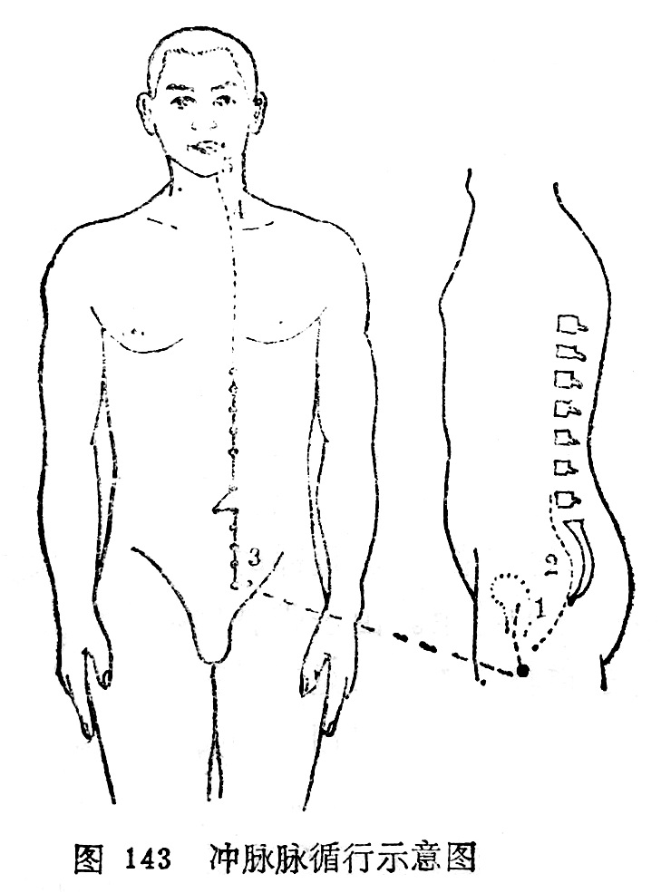

### 三、冲脉

（一）循行路线

〔原文〕《素问·骨空论》：“冲脉者，起于气街(1);并少阴之经(2)。挟脐上行，至胸中而散。”《灵枢·五音五味》：“冲脉任脉，皆起于胞中(3)，上循背里(4)，为经络之海，其浮而外者，循腹上行，会于咽喉，别而络唇口。”

〔注释〕(1)气街：部位名，即[气冲](https://www.gmzyjc.com/read/zjs/zjs3.1.1-3-0.1.3.3.30.md)穴所在妣

(2)并少阴之阴：少阴指足少阴。

(3)胞中：是指子宫。

(4)背里：背是指脊字而言。

〔语译〕1．起于小腹内，下出于[会阴](https://www.gmzyjc.com/read/zjs/zjs3.2.1-0.1.1.3.1.md)部，2．向上行于脊柱之内，3．其外行者经[气冲](https://www.gmzyjc.com/read/zjs/zjs3.1.1-3-0.1.3.3.30.md)与足少阴交会，沿着腹部两侧，4．上达咽喉，5．环绕口唇（图143）。

（二）病候举要  胸腹气逆而拘急。

（三）交会腧穴  [会阴](https://www.gmzyjc.com/read/zjs/zjs3.2.1-0.1.1.3.1.md)、阴交（任脉）、[气冲](https://www.gmzyjc.com/read/zjs/zjs3.1.1-3-0.1.3.3.30.md)（足阳明经）、[横骨](https://www.gmzyjc.com/read/zjs/zjs3.1.7-8-0.0.2.3.11.md)、[大赫](https://www.gmzyjc.com/read/zjs/zjs3.1.7-8-0.0.2.3.12.md)、[气穴](https://www.gmzyjc.com/read/zjs/zjs3.1.7-8-0.0.2.3.13.md)、四海、[中注](https://www.gmzyjc.com/read/zjs/zjs3.1.7-8-0.0.2.3.15.md)、[肓俞](https://www.gmzyjc.com/read/zjs/zjs3.1.7-8-0.0.2.3.16.md)、[商曲](https://www.gmzyjc.com/read/zjs/zjs3.1.7-8-0.0.2.3.17.md)、[石关](https://www.gmzyjc.com/read/zjs/zjs3.1.7-8-0.0.2.3.18.md)、[阴都](https://www.gmzyjc.com/read/zjs/zjs3.1.7-8-0.0.2.3.19.md)、通谷、[幽门](https://www.gmzyjc.com/read/zjs/zjs3.1.7-8-0.0.2.3.21.md)（均属足少阴肾经），共十四穴。

（四）功能  冲脉的“冲”字，含有要冲、要道的意思。冲脉贯串全身，为总领诸经气血的要冲，能调节十二经气血，故有“十二经之海”、“五脏六腑之海”和“[血海](https://www.gmzyjc.com/read/zjs/zjs3.1.4-6-0.0.1.3.10.md)”之称。其脉气在头部灌注诸阳，在下肢渗入三阴，能容纳来自十二经脉五脏六腑的气血，成为十二经脉、五脏六腑之海。冲脉起于胞中，又称“[血海](https://www.gmzyjc.com/read/zjs/zjs3.1.4-6-0.0.1.3.10.md)”，说明冲脉与妊娠胎育密切相关。

（五）主治  气急，胸腹痛，气上冲心，胸脘满闷，结胸，反胃，酒积，食积，肠鸣，水气，泄泻，噎膈，胁胀，脐腹痛，肠风便血，疟疾，月经失调，不孕，漏胎，胎衣不下，血崩昏迷等。
